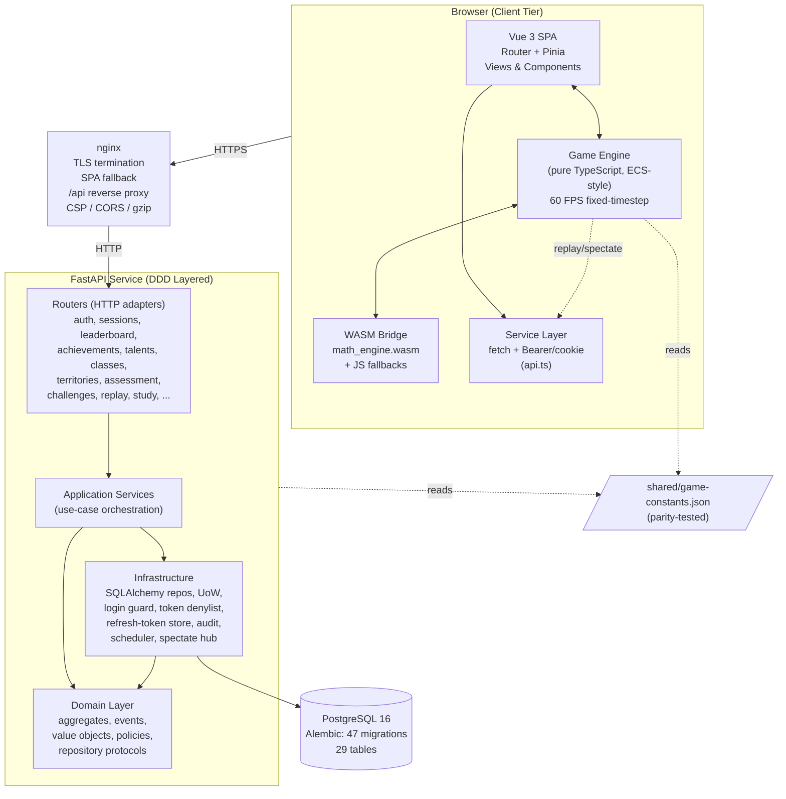
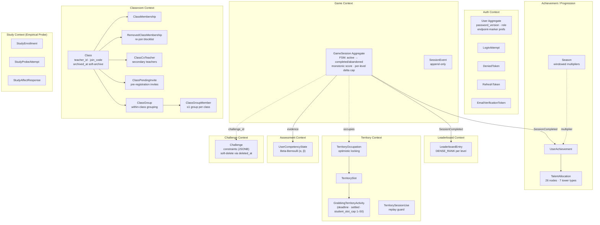
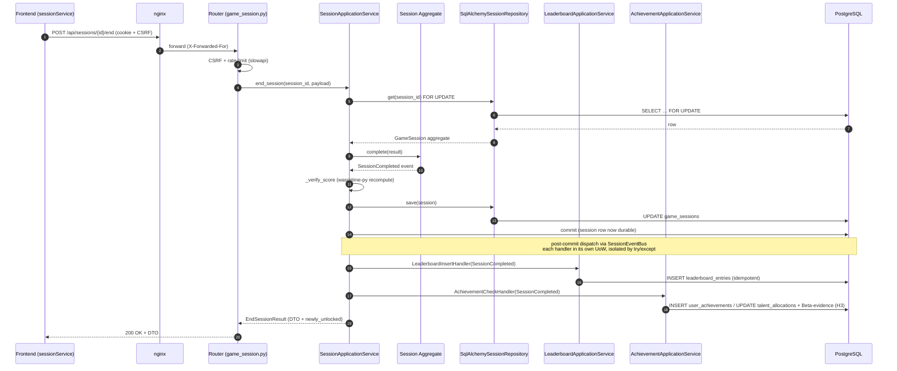
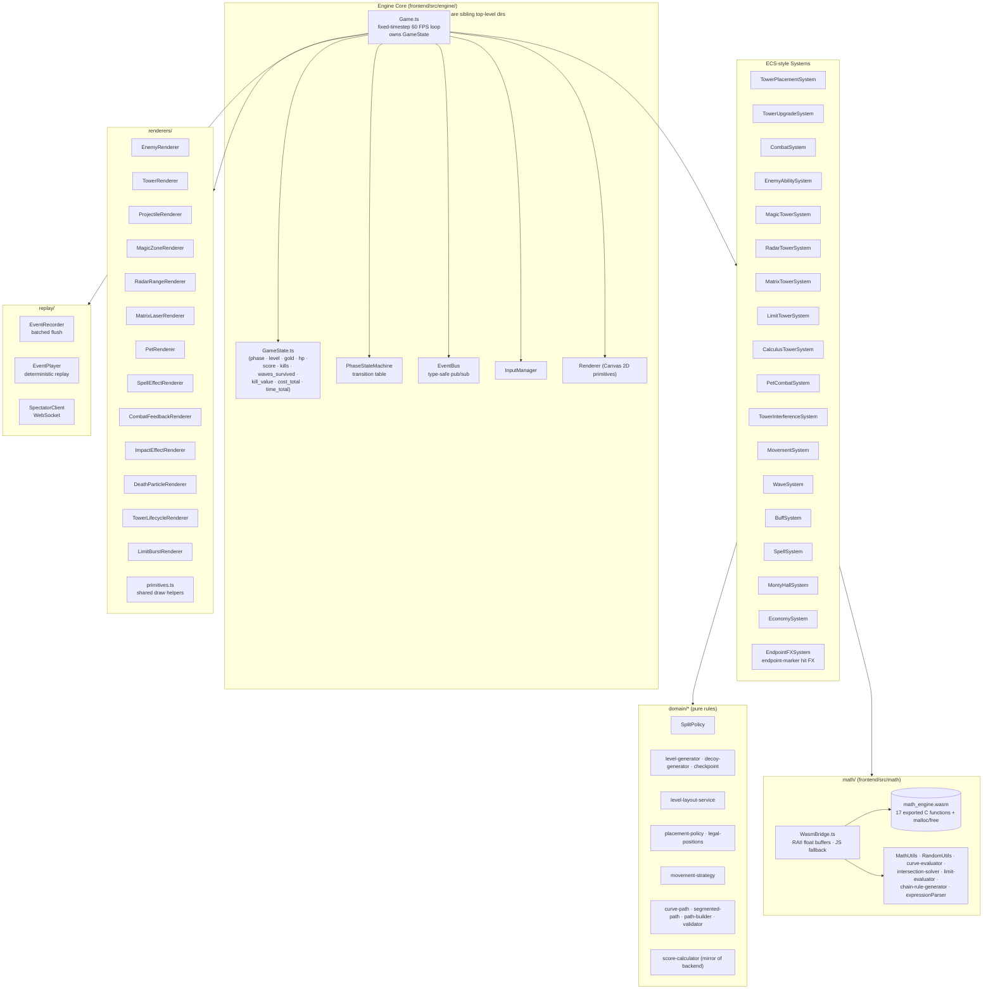
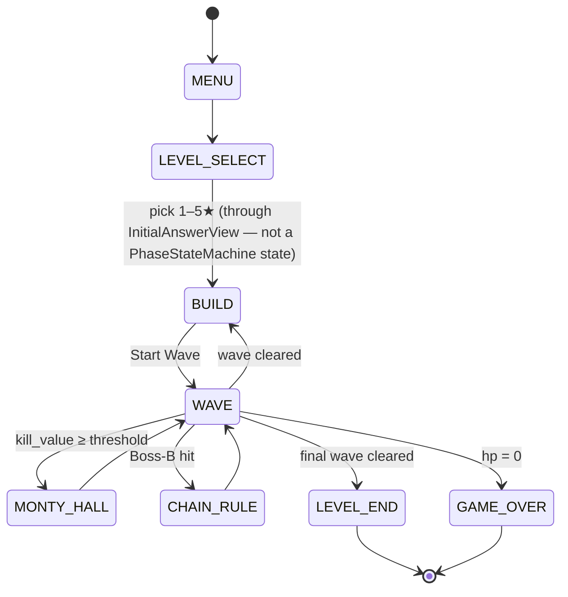
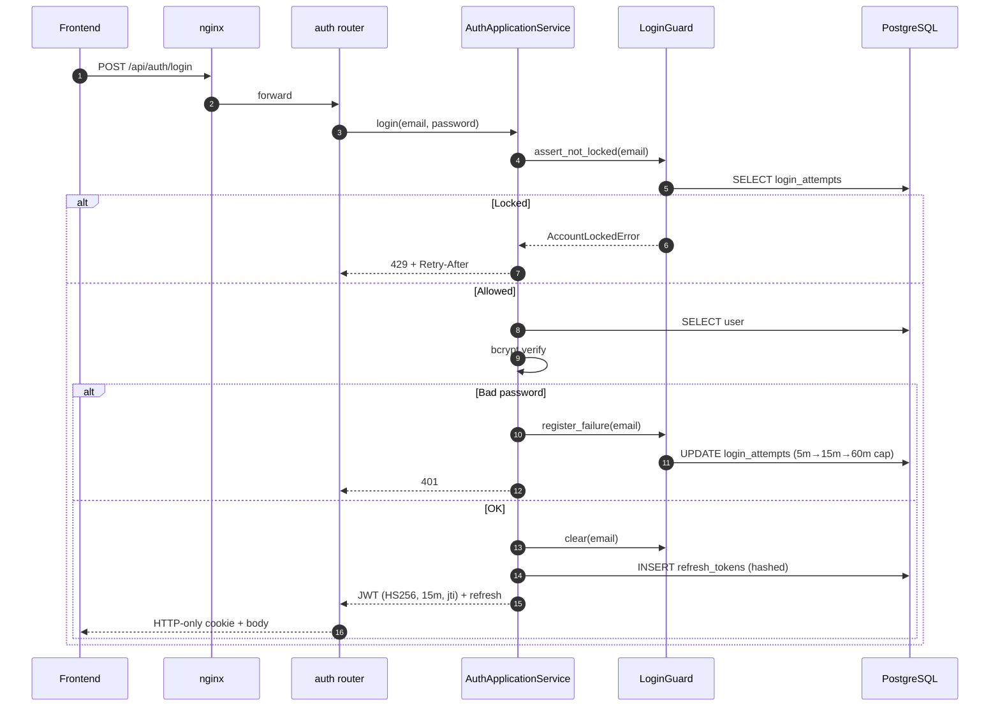
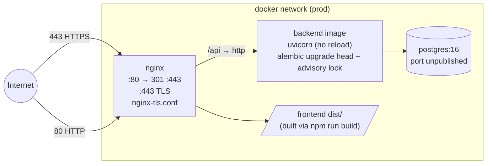

# Math Defense — System Architecture

> Comprehensive architecture reference for the Math Defense educational tower-defense game.
> Generated 2026-05-08, refreshed 2026-05-28 from a full audit of source, schema, and deployment configuration.

This document describes the system from four complementary angles:

1. **High-level topology** — what runs where, how the tiers connect.
2. **Backend (FastAPI, DDD)** — domain → application → infrastructure → HTTP.
3. **Frontend (Vue 3 + pure-TS engine + WASM)** — UI shell, ECS-style systems, rendering.
4. **Cross-cutting** — auth/security, persistence, deployment, build, testing.

All diagrams use [Mermaid](https://mermaid.js.org/). Render directly in GitHub, VS Code, or any Mermaid-aware viewer.

---

## 1. Top-Level Layout

| Path | Role |
|---|---|
| `frontend/` | Vue 3 + Vite SPA. Pure-TS game engine, ECS-style systems, Pinia stores, ~87 Vitest files. |
| `backend/` | FastAPI service with DDD layering, SQLAlchemy ORM, Alembic (47 migrations), ~32 pytest files. |
| `wasm/` | C99 math kernel compiled to WebAssembly via Emscripten (17 user-facing exports + `malloc`/`free`: tower mechanics + replay-v2 PRNG/curve/level-gen + score recompute). Sources: `math_engine.c`, `prng.c/h`, `curve.c/h`, `level_gen.c/h`, `Makefile`. |
| `emsdk/` | Vendored Emscripten SDK (no rebuild required unless updating compiler). |
| `shared/` | `game-constants.json` (canvas/grid/economy single source of truth) + `enemy-defs.json` (enemy stats/abilities, cross-language) + `score_parity_fixtures.json` (cross-language score-formula fixtures). |
| `assets/` | Sprites, audio, fonts (referenced as `frontend/public/`). |
| `docs/` | Project documentation (analysis, audit, educational theory). |
| `docker-compose.yml` | Dev orchestration: Postgres + backend (hot reload) + Vite dev server. |
| `docker-compose.prod.yml` | Production: self-contained images, nginx + TLS termination. |
| `nginx.conf`, `nginx-tls.conf`, `security-headers.conf` | SPA fallback + `/api` reverse proxy + shared security/CSP header snippet (included by both nginx configs). |
| `Math_Defense_Spec.md` | V1 design spec (superseded but retained for V2 lineage). |
| `DATABASE_SCHEMA.md` | Full ERD: 29 tables, constraints, indexes, migration history. |
| `SECURITY.md` | Auth flow, JWT/bcrypt, lockout, MFA, CSRF, CSP, audit logging. |

---

## 2. System Topology



**Key boundaries**

- **Browser ↔ Nginx**: HTTPS only in production; nginx handles TLS, CORS allow-list, security headers, SPA fallback.
- **Nginx ↔ FastAPI**: Plain HTTP on the docker network; no TLS inside the perimeter.
- **FastAPI ↔ Postgres**: psycopg v3 (`postgresql+psycopg://`); Alembic upgrade serialized via advisory lock at startup.
- **Shared constants**: `shared/game-constants.json` consumed by both frontend (Vite import) and backend (`test_shared_constants_parity.py` enforces drift detection).

---

## 3. Backend Architecture (FastAPI + DDD)

### 3.1 Layered View

```mermaid
flowchart LR
    subgraph HTTP["HTTP / Adapter Layer"]
        R[FastAPI Routers<br/>backend/app/routers/*.py]
        S[Pydantic Schemas<br/>backend/app/schemas/*.py]
        MW["Middleware<br/>CSRF · SecurityHeaders · CORS · slowapi"]
    end

    subgraph Application["Application Layer<br/>backend/app/application/"]
        AuthSvc[AuthApplicationService]
        SessionSvc[SessionApplicationService]
        LbSvc[LeaderboardApplicationService]
        AchSvc[AchievementApplicationService]
        TalentSvc[TalentApplicationService]
        ClassSvc[ClassApplicationService]
        AdminSvc[AdminApplicationService]
        TerrSvc[TerritoryApplicationService]
        TerrRecSvc[TerritoryRecommendationService]
        AssessSvc[AssessmentApplicationService]
        RecSvc[RecommenderApplicationService]
        ChalSvc[ChallengeApplicationService]
        ReplaySvc[ReplayApplicationService]
        StudySvc[StudyApplicationService]
        SeasonSvc[SeasonApplicationService]
        EvtHandlers[session_event_handlers.py]
        Ports[ports.py<br/>outbound protocols]
        Mappers[mappers.py<br/>Aggregate → DTO]
    end

    subgraph Domain["Domain Layer<br/>backend/app/domain/<br/>(per-aggregate folders: aggregate.py + policy/definitions + repository protocol)"]
        SessAgg["session/<br/>aggregate · events · events_log · repository"]
        UserAgg["user/<br/>aggregate · value_objects · constraints · repository"]
        LbAgg["leaderboard/<br/>aggregate · view · repository"]
        AchAgg["achievement/<br/>aggregate · definitions · policy · repository"]
        TalentAgg["talent/<br/>aggregate · tree · definitions · repository"]
        ClassAgg["class_/<br/>aggregate · errors · repository"]
        TerrAgg["territory/<br/>aggregate · errors · recommendation · repository"]
        ChalAgg["challenge/<br/>aggregate · constraint_dsl · tower_types · repository"]
        SeasonAgg["season/<br/>aggregate · repository"]
        Assess["assessment/<br/>competencies · q_matrix · q_matrix_defs ·<br/>competency_state · competency_estimator · suggestions"]
        StudyAgg["study/<br/>group_assignment · probe_keys"]
        AuthAgg["auth/<br/>repository (cross-cutting auth protocols)"]
        Scoring["scoring/<br/>score_calculator (S1 / S2 / K / TotalScore)"]
        VO["Top-level: value_objects.py<br/>SessionStatus · Level · Score · GameResult"]
        Errors["Top-level: errors.py<br/>(HTTP-free; mapped by http_status_map.py)"]
        Constraints["Top-level: constraints.py<br/>numeric bounds"]
    end

    subgraph Infra["Infrastructure Layer<br/>backend/app/infrastructure/"]
        UoW["SqlAlchemyUnitOfWork"]
        Repos["SqlAlchemy Repositories<br/>session · user · leaderboard ·<br/>achievement · talent · class ·<br/>territory · challenge · season ·<br/>competency_state · session_event · study"]
        LoginGuard[LoginGuard<br/>brute-force lockout]
        Denylist[Token Denylist]
        Refresh[Refresh-Token Store<br/>rotating · hashed]
        Audit[Audit Logger<br/>isolated txn]
        Email[Email Service]
        Sched[Scheduler<br/>territory settlement<br/>auth janitor]
        Hub[Spectate Hub<br/>in-process pub/sub]
        WasmRT[wasm_runtime<br/>wasmtime-py singleton<br/>shared math_engine.wasm<br/>FU-A score recompute]
    end

    DB[(PostgreSQL 16)]
    Models["SQLAlchemy ORM Models<br/>backend/app/models/*.py"]

    R --> S
    R --> MW
    R --> Application
    Application --> Domain
    Application --> Infra
    Repos -- implement --> SessAgg
    Repos -- implement --> UserAgg
    Repos -- implement --> LbAgg
    Repos --> Models
    Models --> DB
    UoW --> DB
    LoginGuard --> DB
    Denylist --> DB
    Refresh --> DB
    Audit --> DB
    Sched --> Application
    Hub --> ReplaySvc
```



**Layering rules**

- **Domain** has zero imports from FastAPI, Pydantic, or SQLAlchemy. Each aggregate lives in its own folder under `backend/app/domain/<aggregate>/` containing `aggregate.py` (root + entities), `policy.py`/`definitions.py`/`tree.py` (pure rules), and `repository.py` (the repository protocol). Cross-aggregate primitives live at the root: `value_objects.py`, `constraints.py`, `errors.py`. Repository interfaces are `typing.Protocol`s.
- **Application** orchestrates use cases and accepts repository protocols via constructor (DI). Mappers convert aggregates to Pydantic DTOs at the boundary.
- **Infrastructure** is the only place SQLAlchemy lives. Repositories implement the domain protocols. `SqlAlchemyUnitOfWork` is a context manager with explicit `.commit()` and auto-rollback.
- **Routers** are thin: validate input, call one application method, return DTO. The domain layer is HTTP-free — domain errors carry **no** `status_code`; a single mapping table (`app/http_status_map.py`) translates each `DomainError` class to a status code, and a global exception handler (`app/main.py::_domain_error_handler`) applies it (so routers never translate exceptions).

### 3.2 Bounded Contexts and Aggregates



**Domain events (lite event sourcing)**

`GameSession` emits `SessionCreated`, `SessionUpdated`, `SessionCompleted`, `SessionAbandoned`. After the session row itself is committed, `SessionApplicationService` dispatches `SessionCompleted` through `SessionEventBus` to a chain of **three independent, post-commit handlers** (`application/session_event_handlers.py`):

1. `LeaderboardInsertHandler` — create a `LeaderboardEntry` (idempotent via `UNIQUE(session_id)`; skipped for practice-mode and teacher/admin preview runs).
2. `AchievementCheckHandler` — run `AchievementApplicationService.check_and_unlock(...)` (awarding talent points) **and**, when an `AssessmentApplicationService` is wired, write the unlocked achievements' Beta-Bernoulli evidence (`apply_evidence_in_open_uow`) inside the **same** UoW commit (the "H3" fix).
3. `IaAccuracyRefreshHandler` — recompute and persist `User.ia_recent_accuracy` (rolling recent-session fraction).

Each handler runs in **its own Unit of Work** and is isolated by a per-handler `try/except Exception` in `SessionEventBus.dispatch` — a failure in one (or a bug) is logged and does **not** roll back the already-durable session row or suppress the other handlers. Atomicity is guaranteed only *within* `AchievementCheckHandler`: achievement-unlock rows and their Beta-Bernoulli evidence commit together in one UoW. The trade-off is a known durability gap — if the leaderboard insert fails it is logged with **no automatic retry** (a future outbox table would close this); the `UNIQUE(session_id)` constraint keeps any later retry idempotent. (Study `dosage_seconds` is **not** updated by this chain.)

### 3.3 Request Lifecycle (example: end-of-session POST)



### 3.4 Routers (HTTP Surface)

| Router | Mount | Highlights |
|---|---|---|
| `auth.py` | `/api/auth` | register, login, logout, me, refresh; profile sub-routes (`PUT /profile/name`, `/profile/endpoint-marker`); CSRF + lockout-aware |
| `game_session.py` | `/api/sessions` | create, active, patch, end, abandon |
| `leaderboard.py` | `/api/leaderboard` | DENSE_RANK per star, manual submit, personal timeline |
| `achievement.py` | `/api/achievements` | list, summary |
| `talent.py` | `/api/talents` | tree, modifiers, allocate, reset |
| `class_.py` | `/api/classes` | CRUD, join-by-code, student management |
| `admin.py` | `/api/admin` | teacher / class / student listings (RBAC) |
| `territory.py` | `/api/activities` | activities, slot play, rankings, settlement |
| `assessment.py` | `/api/assessment` | per-class posteriors (teacher dashboard) |
| `recommendation.py` | `/api/recommendation` | adaptive star + next talent node |
| `challenge.py` | `/api/challenges` | constraint DSL CRUD, soft-delete |
| `replay.py` | `/api/sessions/{id}/events`, `/replay`, `/spectate` (WS) | append-only event log + live spectate |
| `study.py` | `/api/study` | enroll, probe, affect, CSV export |
| `achievement.py` (seasons_router) | `/api/seasons` | windowed multipliers (admin); `seasons_router` is a sub-router defined in `achievement.py` and mounted separately — there is no standalone `season.py` |

Cross-cutting: `slowapi` rate limits per endpoint, `CsrfMiddleware` (double-submit cookie), `SecurityHeadersMiddleware` (X-Content-Type-Options, X-Frame-Options, Referrer-Policy, Permissions-Policy, no-store on `/api/auth`), `CORSMiddleware` (explicit allow-list, mirrored in nginx for production).

---

## 4. Frontend Architecture

### 4.1 Vue Shell + Pinia + Router

```mermaid
flowchart TB
    Main["main.ts<br/>bootstrap, restore /api/auth/me"]
    App["App.vue<br/>&lt;router-view /&gt;"]
    Router["Vue Router 4<br/>RBAC guards (admin/teacher/student)"]

    subgraph Stores["Pinia Stores"]
        Auth[authStore]
        GameS[gameStore]
        TalentS[talentStore]
        TerritoryS[territoryStore]
        UIs[uiStore]
    end

    subgraph Views["Views (26 .vue route targets)"]
        Menu["Menu / About / Auth / Profile"]
        Play["LevelSelect / InitialAnswer / Game / ScoreResult"]
        Lb["Leaderboard / Rankings"]
        Progression["Achievement / TalentTree"]
        Classroom["Class / Admin / TeacherDashboard"]
        Terr["TerritoryList / TerritoryDetail / TerritoryResult / TeacherTerritorySetup"]
        Chal["Challenge / ChallengeBuilder / ChallengeLeaderboard"]
        Replay["Replay / Spectate"]
        StudyV["StudyProbe / AffectSurvey"]
    end

    subgraph Components["Reusable Components (6 subdirs)"]
        Common[common/<br/>Modal · MathDisplay · markdown helpers]
        Layout[layout/<br/>app chrome]
        GameCmp["game/ (27 .vue files)<br/>HUD · TowerBar · BuildPanel · BuildHint · ShopPanel ·<br/>SpellBar · SpellIcon · StartWaveButton · GameSpeedPanel ·<br/>MagicModePanel · RadarConfigPanel · MatrixPairPanel ·<br/>LimitQuestionPanel · CalculusPanel ·<br/>IntegralPanel · FunctionPanel · ChainRulePanel ·<br/>MontyHallPanel · TargetingModePanel · TowerInfoPanel ·<br/>BuffCardPanel · WaveForecast · FirstEncounterCard ·<br/>AchievementToast · PrincipleOverlay ·<br/>PhaseFader · WaveBanner"]
        Teacher[teacher/CompetencyBar]
        TerritoryCmp[territory/TerritorySlotCard]
        LbCmp[leaderboard/PersonalTimeline]
    end

    subgraph Composables["Composables (22 use*.ts)"]
        Lifecycle["useGameLoop · useSessionSync · useStartRun · useEngineUiBridges · useEngineAudio · useUiAudio · useGlobalMusic"]
        Auth["useAuth · useTokenProbe · useProfileInitials"]
        UI["useCanvasPlot · useKeyboardPlacement · useCountdown · useFirstEncounterCards · usePrincipleOverlay · useChallengePreviewPreference · useManual · useReducedMotion · useValuePop"]
        Data["useLeaderboard · usePolling · useTerritoryRecommendation"]
    end

    Main --> App --> Router --> Views
    Views --> Components
    Views --> Composables
    Views --> Stores
    Composables --> Stores
    Components --> Stores
```



### 4.2 Game Engine (pure TypeScript, ECS-inspired)



**Engine isolation**: `engine/`, `systems/`, `renderers/`, and `domain/` directories have **zero Vue imports**. They are pure TS, drive a `Game` instance, and expose hooks. The Vue shell binds them via `useGameLoop` (mount/unmount, talent modifier injection) and `useSessionSync` (lifecycle ↔ backend session API).

### 4.3 Service Layer

| Service | Role |
|---|---|
| `api.ts` | base fetch wrapper, Bearer auto-attach, throws `ApiError` |
| `authService` | `/api/auth/*` |
| `sessionService` | `/api/sessions/*` raw HTTP |
| `sessionLifecycleService` | create/end/abandon orchestration on top of `sessionService` |
| `gameCommandService` | dispatches in-game commands (replay queue + spectate fan-out) |
| `levelGenerationService` | WASM-vs-JS level generation glue (replay-v1/v2 routing) |
| `waveService` | wave-spec lookup / preview |
| `leaderboardService`, `rankingService` | `/api/leaderboard/*`, global / personal rankings |
| `achievementService`, `seasonService` | `/api/achievements/*`, `/api/seasons/*` |
| `talentService` | `/api/talents/*` |
| `classService`, `adminService` | `/api/classes/*`, `/api/admin/*` |
| `territoryService` | `/api/activities/*` |
| `assessmentService`, `recommendationService` | `/api/assessment/*`, `/api/recommendation/*` |
| `challengeService` | `/api/challenges/*` |
| `studyService` | `/api/study/*` |
| `imageCache` | client-side decode/cache of endpoint-marker data URLs (no HTTP) |

---

## 5. WebAssembly Math Kernel

C99 sources in `wasm/` (`math_engine.c`, `prng.c/h`, `curve.c/h`, `level_gen.c/h`), compiled by Emscripten (`wasm/Makefile`, invoked as `make -f wasm/Makefile` after activating the vendored `emsdk/`) to `frontend/src/math/wasm/math_engine.{js,wasm}` plus an auto-generated `frontend/src/math/wasm-exports.d.ts`. The bridge layer (`WasmBridge.ts`) provides:

- **RAII float-buffer helpers** that allocate via `malloc`, hand a typed view to the caller, and `free` on disposal.
- **JS fallbacks** for every export, gated by `setUseWasm(false)` for diagnostics.
- **Parity tests** in Vitest verify WASM and JS implementations agree numerically.

| Export | Use in game |
|---|---|
| `matrix_multiply` | Matrix tower (paired-tower transform) |
| `sector_coverage`, `point_in_sector` | Radar A/B/C arc / hit-test |
| `numerical_integrate` | Calculus tower integral picker |
| `prng_seed`, `prng_next_u32`, `prng_next_f64` | Replay-v2 PCG XSL-RR 64/32 stream |
| `curve_evaluate`, `curve_derivative`, `curve_in_domain` | Polynomial / trig / log curve evaluator |
| `find_pair_intersections`, `find_all_curves_common_point`, `count_common_intersections_in_interval` | Level-generator intersection solver |
| `compute_spawn_points` | Boundary-crossing bisection for the 2-spawn-per-curve rule |
| `generate_level` | Full rejection-sampling loop (8 batches × 50 attempts) |
| `power_f64` | musl-backed `pow(base, exp)` shared with backend score recompute (FU-A) |
| `compute_total_score` | C-side mirror of the canonical scoring formula |
| `malloc`, `free` | Bridge memory plumbing |

`ALLOW_MEMORY_GROWTH=1`, `MAXIMUM_MEMORY=256MiB`. Single linear heap. The
build pins `-fno-fast-math -fno-unsafe-math-optimizations -ffp-contract=off`
so the compiler emits no FMA fusions or algebraic rewrites of
transcendentals — without these, `sinf/cosf/logf/asinf/acosf` would diverge
across emcc versions and break replay v2's bit-exactness contract (see §5.1).

### 5.1 Replay-determinism contract

Replays are versioned via the `game_sessions.replay_version` column:

| Version | PRNG | Transcendentals | Acceptance |
|---|---|---|---|
| `1` (legacy) | `mulberry32` (JS) | `Math.sin/cos/log/asin/acos` (host engine) | final score within `ε = 0.0005` |
| `2` (current default when WASM is loaded) | PCG XSL-RR 64/32 (in WASM) | musl `sinf/cosf/logf/asinf/acosf` (compiled into the .wasm) | **bit-exact** final score |

Session-creation flow:

1. `LevelSelectView` / `TerritoryDetailView` `await whenWasmReady()`. If
   `isUsingWasm()` returns true, the level is generated through
   `generateLevelDeterministicFromSeed` (PCG + WASM curve evaluator) and
   the new session is tagged `replay_version=2`. Otherwise the JS
   `generateLevel(seed, mulberry32(seed))` path runs and the session is
   tagged `replay_version=1`. The two paths **must not be mixed** for a
   single session — that would produce a layout the replay cannot
   reconstruct from the same seed.
2. `useSessionSync` reads `isUsingWasm()` at session-create time and
   forwards the version to `POST /api/sessions`.
3. Backend `SessionCreate` accepts `replay_version: int (1|2)` and stores
   it on the aggregate; `ReplayBundleOut` echoes it back on
   `GET /api/sessions/{id}/replay`.

Session-replay flow (`ReplayView.vue`):

1. Fetch the bundle. `bundle.replay_version` decides the path.
2. If `2`: `await initWasm()`. If WASM fails to load, surface a hard error
   ("browser does not support replay v2") rather than silently regenerating
   a different layout. Otherwise call
   `generateLevelDeterministicFromSeed(starRating, seed)` and seed the
   game with `createPrng(seed)`.
3. If `1`: legacy path — `generateLevel(starRating, mulberry32(seed))`,
   `Game.setSeed(seed)` falls through to mulberry32.

The lint rule `npm run lint-determinism` (Phase 5 of the construction
plan) bans `Math.sin/cos/tan/asin/acos/atan/atan2/log/log2/log10/exp/pow`
in the directories that reach the v2 reconstruction code path:
`src/domain/level/`, `src/domain/scoring/`, `src/math/curve-evaluator.ts`,
`src/engine/Game.ts`, `src/systems/`. Pre-existing legacy callers carry
per-line opt-outs with a follow-up reference; new code must route through
`WasmBridge`. The `domain/scoring/` entry was added with FU-A so the
frontend score formula uses the same musl `pow` the backend recomputes
against (see §5.2).

### 5.2 Server-side replay validation (FU-A)

For `replay_version=2` sessions the backend recomputes `total_score` from
the asserted `ScoreInput` (kill_value, time_total, cost_total, HP delta,
prep-phase durations) using the **same** musl `pow` the browser ran.
`app/infrastructure/wasm_runtime.py` loads the same `math_engine.wasm`
artifact the frontend ships, instantiates it under wasmtime-py, and
exposes a singleton `power_f64(base, exp)` callable. The score recompute
in `app/domain/scoring/score_calculator.py` accepts a `pow_fn`
parameter; `SessionApplicationService._verify_score` injects the WASM
callable so the recomputed value is bit-equal to the browser-displayed
`totalScore`.

Acceptance flow:

1. Client submits `total_score` on `POST /api/sessions/{id}/end`.
2. Server recomputes via wasmtime-py.
3. **v2 path:** if `|submitted - recomputed| > 1e-4` (rounding tolerance
   only — the formula itself agrees byte-for-byte), raise
   `ReplayMismatchError → HTTP 422 {"detail": "replay_mismatch"}`.
4. **v1 path:** legacy ε=5e-4 tolerance, mismatch logs a warning and
   the canonical server value overwrites the client one.
5. **WASM unavailable:** if wasmtime-py or `math_engine.wasm` are
   missing at boot, the singleton falls back to Python `pow` and even
   v2 sessions widen to v1's ε tolerance — bit-equality cannot be
   guaranteed without the shared musl. The fallback is logged loudly
   so a misconfigured deploy is visible.

Today's coverage stops at score-formula tampering. A richer attack —
fabricating the entire event stream so the resulting `ScoreInput`
*itself* is a lie — is out of scope and waits on the full Python port
of `EventPlayer`'s tick logic (construction plan §8 FU-A "not yet
landed" note).

---

## 6. Database Schema (Logical View)

> Authoritative reference: `DATABASE_SCHEMA.md` (full column / constraint / index detail). The diagram below is **exhaustive** — it depicts all 29 tables and every foreign-key relationship, with concise key-column blocks. Four tables carry no foreign keys: `seasons` (its talent-point multiplier is applied *logically* by timestamp window — shown dashed below, there is no FK to `user_achievements`), `login_attempts`, `denied_tokens`, and `audit_logs` (whose `user_id` deliberately omits its FK so audit history survives user deletion).

```mermaid
erDiagram
    %% -- Core user associations --
    USERS ||--o{ CLASSES : "teaches (teacher_id RESTRICT)"
    USERS ||--o{ CLASS_MEMBERSHIPS : "member_of (student_id)"
    USERS ||--o{ REMOVED_CLASS_MEMBERSHIPS : "removed (student_id)"
    USERS ||--o{ CLASS_CO_TEACHERS : "co-teaches (teacher_id)"
    USERS ||--o{ CLASS_GROUP_MEMBERS : "grouped (student_id)"
    USERS ||--o{ GAME_SESSIONS : "plays (user_id)"
    USERS |o--o{ LEADERBOARD_ENTRIES : "scored (user_id SET NULL)"
    USERS ||--o{ USER_ACHIEVEMENTS : "earns"
    USERS ||--o{ TALENT_ALLOCATIONS : "allocates"
    USERS ||--o{ USER_COMPETENCY_STATE : "tracked_by"
    USERS ||--o{ REFRESH_TOKENS : "rotates"
    USERS ||--o{ EMAIL_VERIFICATION_TOKENS : "verifies_via"
    USERS ||--o{ CHALLENGES : "authors (teacher_id)"
    USERS ||--o{ STUDY_ENROLLMENTS : "enrolls"
    USERS ||--o{ STUDY_PROBE_ATTEMPTS : "submits"
    USERS ||--o{ STUDY_AFFECT_RESPONSES : "rates"
    USERS ||--o{ TERRITORY_OCCUPATIONS : "occupies (student_id)"
    USERS ||--o{ TERRITORY_RANKINGS_SNAPSHOT : "ranked (student_id)"
    USERS ||--o{ GRABBING_TERRITORY_ACTIVITIES : "creates (teacher_id)"
    USERS |o--o{ GRABBING_TERRITORY_ACTIVITIES : "settles (settled_by SET NULL)"

    %% -- Class associations --
    CLASSES ||--o{ CLASS_MEMBERSHIPS : "enrolls (class_id)"
    CLASSES ||--o{ REMOVED_CLASS_MEMBERSHIPS : "removal_log (class_id)"
    CLASSES ||--o{ CLASS_CO_TEACHERS : "co-taught (class_id)"
    CLASSES ||--o{ CLASS_PENDING_INVITES : "pre-invites (class_id)"
    CLASSES ||--o{ CLASS_GROUPS : "groups (class_id)"
    CLASSES ||--o{ CLASS_GROUP_MEMBERS : "group_link (class_id denorm.)"
    CLASSES |o--o{ GRABBING_TERRITORY_ACTIVITIES : "hosts (class_id nullable)"
    CLASS_GROUPS ||--o{ CLASS_GROUP_MEMBERS : "members (group_id)"

    %% -- Challenge mode --
    CHALLENGES |o--o{ GAME_SESSIONS : "scoped (challenge_id SET NULL)"
    CHALLENGES |o--o{ LEADERBOARD_ENTRIES : "ranks (challenge_id CASCADE)"

    %% -- Session -> projections / territory (session_id is UNIQUE on both projections) --
    GAME_SESSIONS ||--o{ SESSION_EVENTS : "recorded (session_id)"
    GAME_SESSIONS |o--o| LEADERBOARD_ENTRIES : "logged_as (session_id UNIQUE)"
    GAME_SESSIONS |o--o| TERRITORY_OCCUPATIONS : "used_for (session_id UNIQUE)"
    GAME_SESSIONS ||--o| TERRITORY_SESSION_USES : "replay_guard (session_id PK)"

    %% -- Territory hierarchy --
    GRABBING_TERRITORY_ACTIVITIES ||--o{ TERRITORY_SLOTS : "has (activity_id)"
    TERRITORY_SLOTS ||--o| TERRITORY_OCCUPATIONS : "occupied_by (slot_id UNIQUE)"
    GRABBING_TERRITORY_ACTIVITIES ||--o{ TERRITORY_RANKINGS_SNAPSHOT : "snapshots (activity_id)"

    %% -- Seasons: logical (no FK) --
    SEASONS ||..o{ USER_ACHIEVEMENTS : "multiplier by time-window (no FK)"

    USERS {
        uuid id PK
        string email UK
        string player_name
        string password_hash
        string role
        int password_version
        float ia_recent_accuracy
        string endpoint_marker_style "nullable, CHECK allowlist"
        text endpoint_marker_custom_dataurl "nullable"
        string endpoint_hit_fx "nullable, CHECK allowlist"
    }
    CLASSES {
        uuid id PK
        uuid teacher_id FK "-> users RESTRICT"
        string join_code UK "8-char UPPER"
        datetime archived_at "nullable soft-archive"
    }
    CLASS_MEMBERSHIPS {
        uuid id PK
        uuid class_id FK "-> classes CASCADE"
        uuid student_id FK "-> users CASCADE"
    }
    REMOVED_CLASS_MEMBERSHIPS {
        uuid id PK
        uuid class_id FK "-> classes CASCADE"
        uuid student_id FK "-> users CASCADE"
    }
    CLASS_CO_TEACHERS {
        uuid id PK
        uuid class_id FK "-> classes CASCADE"
        uuid teacher_id FK "-> users CASCADE"
    }
    CLASS_PENDING_INVITES {
        uuid id PK
        uuid class_id FK "-> classes CASCADE"
        string email "UNIQUE per class"
    }
    CLASS_GROUPS {
        uuid id PK
        uuid class_id FK "-> classes CASCADE"
        string name "UNIQUE per class"
    }
    CLASS_GROUP_MEMBERS {
        uuid group_id PK,FK "-> class_groups CASCADE"
        uuid student_id PK,FK "-> users CASCADE"
        uuid class_id FK "-> classes (denormalised)"
    }
    GAME_SESSIONS {
        uuid id PK
        uuid user_id FK "-> users CASCADE"
        uuid challenge_id FK "-> challenges SET NULL, nullable"
        int star_rating
        string status
        bool practice_mode
        bool is_preview
        int gold
        int hp
        int score
        float total_score
        bigint rng_seed
        smallint replay_version "1=JS, 2=WASM bit-exact"
        timestamptz started_at
        timestamptz ended_at
    }
    LEADERBOARD_ENTRIES {
        uuid id PK
        uuid user_id FK "-> users SET NULL, nullable"
        uuid session_id FK "-> game_sessions SET NULL, UNIQUE"
        uuid challenge_id FK "-> challenges CASCADE, nullable"
        int level
        int score
        float total_score "nullable"
    }
    SESSION_EVENTS {
        bigserial id PK
        uuid session_id FK "-> game_sessions CASCADE"
        int seq "UNIQUE(session_id, seq)"
        float ts "game-time seconds"
        string event_type
        jsonb payload
    }
    USER_ACHIEVEMENTS {
        uuid id PK
        uuid user_id FK "-> users CASCADE"
        string achievement_id
        int talent_points
        timestamptz unlocked_at
    }
    TALENT_ALLOCATIONS {
        uuid id PK
        uuid user_id FK "-> users CASCADE"
        string talent_node_id
        int current_level "CHECK >= 1"
    }
    CHALLENGES {
        uuid id PK
        uuid teacher_id FK "-> users CASCADE"
        jsonb constraints
        timestamptz deleted_at "soft delete"
    }
    USER_COMPETENCY_STATE {
        uuid user_id PK,FK "-> users CASCADE"
        string competency PK
        float alpha "CHECK > 0"
        float beta "CHECK > 0"
    }
    GRABBING_TERRITORY_ACTIVITIES {
        uuid id PK
        uuid class_id FK "-> classes CASCADE, nullable"
        uuid teacher_id FK "-> users CASCADE"
        uuid settled_by FK "-> users SET NULL, nullable"
        datetime deadline
        bool settled
        int student_slot_cap "CHECK 1..50"
    }
    TERRITORY_SLOTS {
        uuid id PK
        uuid activity_id FK "-> activities CASCADE"
        int star_rating "CHECK 1..5"
        int slot_index "CHECK 0..49"
    }
    TERRITORY_OCCUPATIONS {
        uuid id PK
        uuid slot_id FK "-> slots CASCADE, UNIQUE"
        uuid student_id FK "-> users CASCADE"
        uuid session_id FK "-> game_sessions SET NULL, UNIQUE"
        float score
    }
    TERRITORY_SESSION_USES {
        uuid session_id PK,FK "-> game_sessions CASCADE"
    }
    TERRITORY_RANKINGS_SNAPSHOT {
        uuid id PK
        uuid activity_id FK "-> activities CASCADE"
        uuid student_id FK "-> users CASCADE"
        float territory_value
        int rank
    }
    REFRESH_TOKENS {
        uuid id PK
        uuid user_id FK "-> users CASCADE"
        string token_hash UK "SHA-256 hex"
        bool used
        bool revoked
    }
    EMAIL_VERIFICATION_TOKENS {
        uuid id PK
        uuid user_id FK "-> users CASCADE"
        string token UK
        bool used
    }
    STUDY_ENROLLMENTS {
        uuid user_id PK,FK "-> users CASCADE"
        string study_id PK
        string group "A|B"
        int dosage_seconds
    }
    STUDY_PROBE_ATTEMPTS {
        serial id PK
        uuid user_id FK "-> users CASCADE"
        string form "pre|post|delay"
        int score "0..10"
    }
    STUDY_AFFECT_RESPONSES {
        serial id PK
        uuid user_id FK "-> users CASCADE"
        string phase "pre|post"
        float anxiety_mean
        float motivation_mean
    }
    SEASONS {
        string season_id PK "slug"
        string name
        datetime starts_at
        datetime ends_at "CHECK > starts_at"
    }
    LOGIN_ATTEMPTS {
        string username PK
        int failures
        datetime locked_until "nullable"
        int lockout_count
    }
    DENIED_TOKENS {
        string jti PK
        datetime expires_at
    }
    AUDIT_LOGS {
        uuid id PK
        string user_id "nullable, NO FK"
        string event_type
        datetime created_at
    }
```



**Notable schema features**

- Partial unique index `uq_one_active_per_user WHERE status='active'` enforces "at most one active session per user" without blocking completed/abandoned rows.
- `LeaderboardEntry.session_id` is `UNIQUE` so the post-completion projection is naturally idempotent.
- `SessionEvent` is append-only with `UNIQUE(session_id, seq)` — clients can safely retry batched flushes.
- `audit_logs` deliberately has **no FK on `user_id`** so audit history survives user deletion; written via an isolated SQLAlchemy session that survives the surrounding transaction's rollback.
- `challenges.deleted_at` (soft delete) lets historical leaderboard rows still resolve `challenge_id` after a teacher archives a challenge.
- Composite-PK Beta-Bernoulli posteriors (`UserCompetencyState`) — the math engine for stealth assessment.

---

## 7. Game Domain & Mechanics

### 7.1 Game-State FSM



### 7.2 Towers (V2)

| Tower | Concept | Mechanic |
|---|---|---|
| **Magic** | Polynomial / Trig / Log curves | Function-curve overlay zone; debuffs enemies, buffs nearby towers |
| **Radar A** | Trigonometry & sectors | Continuous arc-sweep AoE |
| **Radar B** | Polar coordinates | Single-target fast follow-fire |
| **Radar C** | Angular momentum | Slow, high-damage projectiles |
| **Matrix** | Linear transforms | Paired towers; laser between pair, dot-product damage |
| **Limit** | Limits (lim x→·) | Multiple-choice question sets effective range (∞ / -∞ / 0) |
| **Calculus** | Derivatives & integrals | Player-defined function spawns autonomous Pet projectiles |

### 7.3 Enemies

General · Fast · Strong (high-HP) · Split (spawns children on death) · Helper (heals/speed-buffs nearby enemies) · Boss-A (periodically spawns minions) · Boss-B (triggers a chain-rule question at a per-spawn HP fraction; splits on death) · Regenerator (constant HP regen, uninterrupted by damage) · Bulwark · Swarmling. (`EnemyType` enum in `frontend/src/data/constants.ts`; visuals/abilities in `data/enemy-defs.ts` + `systems/EnemyAbilitySystem.ts`.)

### 7.4 Progression Systems

| System | Mechanism | Persistence |
|---|---|---|
| Achievements | 29 definitions across 6 categories (combat, scoring, survival, efficiency, exploration, territory) | `user_achievements` (talent points awarded) |
| Talent Tree | 26 nodes (19 base + 7 tier-2) / 7 tower types / prereq chains (incl. `prerequisite_max_levels` for tier-2); frontend renders per-tower mini-trees in a 2-column grid with tower-color theming and dashed borders on tier-2 nodes | `talent_allocations` |
| Seasons | Time-windowed multipliers on talent points | `seasons` |
| Leaderboard | Per-star DENSE_RANK + global rank | `leaderboard_entries` |
| Grabbing Territory | Teacher activity (per-activity `student_slot_cap`, 1–50); students seize slots by score | `territory_*` (optimistic locking) |
| Stealth Assessment | Beta-Bernoulli posteriors per Q-matrix evidence | `user_competency_state` |
| Empirical Validity Probe | A/B groups; pre/post/delay forms; affect surveys | `study_*` (CSV export for analysis) |

---

## 8. Authentication & Security

### 8.1 Token Lifecycle



### 8.2 Defenses at a glance

- **Password storage**: bcrypt; minimum length and char-class checks.
- **Access tokens**: HS256 JWT, 15-minute TTL (configurable via `ACCESS_TOKEN_EXPIRE_MINUTES`), claims include `sub`, `jti`, `pv` (password_version), `exp`, `iat`, `iss`, `aud`. Changing the password increments `pv`, globally invalidating outstanding tokens.
- **Refresh tokens**: rotating; SHA-256 hashed at rest; `used` flag flips on rotation; `revoked` flag for logout-all.
- **Token denylist**: `denied_tokens.jti` set on logout; pruned at natural expiry by the auth janitor (every 10 min).
- **Brute-force lockout**: per-account 5 failures / 5 min → 5m → 15m → 60m cap backoff (tracked via `login_attempts.lockout_count`). Returns `429` + `Retry-After`.
- **CSRF**: double-submit cookie + `X-CSRF-Token` header on unsafe methods (opt-out only under pytest/CI).
- **Rate limiting**: slowapi per route (auth tighter than gameplay endpoints).
- **MFA**: optional TOTP, with step-replay guard via `totp_last_used_at`.
- **Audit log**: `record_audit_event()` writes via an isolated session so it survives the outer transaction's rollback; no FK on `user_id`.
- **Headers** (nginx + middleware): CSP, X-Frame-Options DENY, X-Content-Type-Options nosniff, Referrer-Policy strict-origin-when-cross-origin, Permissions-Policy disabling camera/mic/geolocation/payment, no-store on `/api/auth`.

---

## 9. Build & Deployment

### 9.1 Development

```bash
docker compose up   # older standalone installs: docker-compose up
# Frontend (Vite dev server with HMR): http://localhost:5173
# Backend (uvicorn --reload):           http://localhost:8000
# Postgres:                             127.0.0.1:5432 (host-mapped, dev only)
```

`docker-compose.yml` bind-mounts `frontend/`, `backend/`, and `shared/` for hot reload.

### 9.2 Production

```bash
docker compose -f docker-compose.prod.yml up --build -d
```



**Production differences vs dev**

- Self-contained images (no source bind-mounts).
- Frontend built with `npm run build`; nginx serves the `dist/`.
- Postgres port unpublished; only reachable on the docker network.
- TLS termination via `nginx-tls.conf` with certs mounted read-only at `/etc/nginx/certs/`.
- `:80 → :443` 301 redirect.
- CORS allow-list driven by env vars (`CORS_ORIGIN_1`, `CORS_ORIGIN_2`).
- Alembic upgrade serialised across replicas via a Postgres advisory lock at startup.

### 9.3 Background workers

- **Territory settlement** — 5-minute (300 s) poll job calls `TerritoryApplicationService.settle_expired()` for activities past their deadline (`backend/app/infrastructure/scheduler.py`).
- **Auth-store janitor** — 10-minute (600 s) purge of expired denylist rows and stale login-attempt rows (defined inline in `backend/app/main.py::_auth_store_janitor`).
- **Spectate hub** — in-process pub/sub for `/api/sessions/{id}/spectate` WebSocket fan-out (bounded queue per subscriber).

The two poll jobs (territory settlement, auth-store janitor) are started as `asyncio` tasks inside the FastAPI lifespan (`backend/app/main.py::lifespan`). The spectate hub is **not** a lifespan task — it is an in-process pub/sub object instantiated on demand by the replay router.

---

## 10. Testing Strategy

### Backend (pytest, ~32 test files)

- **Domain unit tests** — pure aggregate logic, value objects, invariants (no DB).
- **Repository / integration tests** — real Postgres, TRUNCATE-per-test isolation, async-capable via pytest-asyncio.
- **Router tests** — FastAPI TestClient end-to-end (auth, RBAC, rate-limit headers).
- **Cross-cutting tests** — shared-constants parity, score recomputation vs client claim, audit-driven coverage gaps (negative HP, score regress, over the per-level score-delta cap), `wasmtime-py` runtime singleton (load/fallback/threading), v2 strict-rejection 422 path.

### Frontend (Vitest + happy-dom, ~87 test files)

- Engine systems, GameState and PhaseStateMachine.
- Domain policies (split, level-generator, path-validator, placement-policy).
- Movement / path / spawn / projection.
- WASM ↔ JS parity for every exported function.
- Replay determinism (EventPlayer reproduces final state from `rng_seed` + recorded events).
- Score calculator parity with backend.
- Audio AssetManager, keyboard placement (WCAG 2.1.1).

---

## 11. Cross-Cutting Architectural Decisions

| Decision | Rationale |
|---|---|
| Domain errors are HTTP-free; `app/http_status_map.py` maps each error class → status | Routers stay thin; one global exception handler applies the mapping. |
| Repository **protocols** (not inheritance) | Domain free of ORM; in-memory test doubles are trivial. |
| Lite event sourcing for sessions | `SessionCompleted` is dispatched **post-commit** to independent handlers, each in its own UoW and isolated by a per-handler `try/except`; only achievement-unlock + Beta-evidence commit atomically together (H3). Chosen for resilience over cross-handler atomicity — a failed leaderboard insert is logged, not retried (an outbox is future work), and `UNIQUE(session_id)` keeps retries idempotent. |
| Append-only `session_events` | Replay and live spectate need a deterministic, immutable record. |
| Partial unique index on active session | "At most one active session per user" without blocking completed rows. |
| Rotating refresh tokens, hashed | Compromise window bounded; reuse of a `used` token is detectable. |
| JWT denylist (not full revocation list) | Rows pruned at natural expiry — lighter than tracking every token. |
| WASM with parity-tested JS fallback | Hot-path performance plus graceful degradation. |
| `shared/game-constants.json` | Canvas, grid, economy values consumed by both sides; parity test prevents drift. |
| Optimistic locking on territory occupation | Concurrent slot grabs fail loudly so the client can retry. |
| Soft delete for challenges | Historical leaderboard entries still resolve `challenge_id`. |
| Practice-mode flag on session | Lets students drill without polluting leaderboards; achievements/talents still award. |
| Reflection text post-session | Articulation prompt; logged but not scored. |
| Bayesian competency state | Stealth assessment without explicit probes per session; informs adaptive recommendations. |
| Scoring duplicated client and server | Server is canonical for anti-cheat; client mirror keeps UX live. |
| Visual Redesign (Phases 0–7 + Spell Re-skin 0–2) | Math-instrument tower silhouettes, glyph-body enemies, cyan-fringe pets, gold-fringe spell glyphs; all motion-heavy effects gated behind `useReducedMotion`. |
| Endpoint-marker customization persisted on `users` | Per-player marker style / custom image / hit-FX preferences (`endpoint_marker_style`, `endpoint_marker_custom_dataurl`, `endpoint_hit_fx`, DB-level CHECK allowlists) saved via `PUT /api/auth/profile/endpoint-marker` and replayed deterministically by `EndpointFXSystem` (`random` resolves through `game.rng`). |

---

## 12. File Map (cheat sheet)

```
backend/
  app/
    main.py                      # FastAPI app + lifespan (alembic, scheduler, auth janitor)
    factories.py                 # ServiceContainer DI wiring
    config.py                    # pydantic-settings (NOT under app/core/)
    limiter.py                   # slowapi limiter singleton
    http_status_map.py           # domain error → HTTP status
    shared_constants.py          # loader for shared/game-constants.json
    seed.py                      # demo-user seeding
    db/                          # engine, SessionLocal
    middleware/                  # auth.py, csrf.py
    utils/                       # security.py (JWT, bcrypt), totp.py, integrity.py, encryption.py
    domain/                      # per-aggregate folders (aggregate root + policy + repository protocol)
      session/   user/   leaderboard/   achievement/   talent/   class_/
      territory/   challenge/   season/   assessment/   study/   scoring/   auth/
      value_objects.py   constraints.py   errors.py
    application/                 # 15 *_service.py + ports.py + mappers.py
                                 # session_event_handlers.py wires SessionCompleted consumers
    infrastructure/
      persistence/               # SqlAlchemy*Repository (16 files)
      unit_of_work.py
      login_guard.py   token_denylist.py   audit_logger.py
      email_service.py   scheduler.py   spectate_hub.py
      wasm_runtime.py            # wasmtime-py singleton, hosts math_engine.wasm
    models/                      # SQLAlchemy ORM models (22 files, 29 tables)
    routers/                     # FastAPI routers (13 thin adapters: achievement, admin, assessment,
                                 # auth, challenge, class_, game_session, leaderboard, recommendation,
                                 # replay, study, talent, territory)
    schemas/                     # Pydantic DTOs
  alembic/                       # 47 migrations
  tests/                         # ~32 pytest files

frontend/
  src/
    main.ts   App.vue
    router/                      # RBAC-aware routes
    stores/                      # Pinia: auth, game, talent, territory, ui
    views/                       # 26 page-level .vue files
    components/                  # common, layout, game (28 .vue), teacher, territory, leaderboard
    composables/                 # 22 use*.ts (lifecycle, auth, UI, data)
    services/                    # api.ts + 19 per-domain clients (incl. imageCache)
    engine/                      # Game.ts, GameState, PhaseStateMachine, EventBus,
                                 # Renderer, InputManager, register-systems,
                                 # audio/, event-handlers/, projections/,
                                 # render-helpers/, replay/
    systems/                     # 18 ECS-style systems (sibling of engine/)
    renderers/                   # 13 canvas renderers + primitives.ts
    domain/                      # pure rules: combat, level, movement, path, placement,
                                 # scoring, study, wave
    math/                        # WasmBridge, MathUtils, evaluators, wasm/
    entities/                    # Tower/Enemy/Projectile/Pet types + factories
    data/                        # tower-defs, enemy-defs, achievement-defs, talent-defs, ...
    lib/   utils/   styles/      # misc helpers, shared utilities, global CSS
  tests/                         # Vitest suites (~87 files including in-tree *.test.ts)

wasm/                            # C99 sources (math_engine.c, prng.c/h, curve.c/h, level_gen.c/h) + Makefile (Emscripten)
emsdk/                           # vendored toolchain
shared/                          # game-constants.json + enemy-defs.json + score_parity_fixtures.json
docs/                            # analysis / audit / educational-theory docs
docker-compose.yml               # dev
docker-compose.prod.yml          # prod
nginx.conf  nginx-tls.conf  security-headers.conf  # reverse proxy + TLS + shared headers
ARCHITECTURE.md  DATABASE_SCHEMA.md  SECURITY.md  Math_Defense_Spec.md  README.md  # repo-root docs
```

---

*End of architecture reference. Update this file when domain boundaries, persistence, or deployment topology change. Use the matching parity tests (`backend/tests/test_shared_constants_parity.py`, WASM/JS parity in Vitest) to enforce the cross-cutting invariants this document depends on.*
