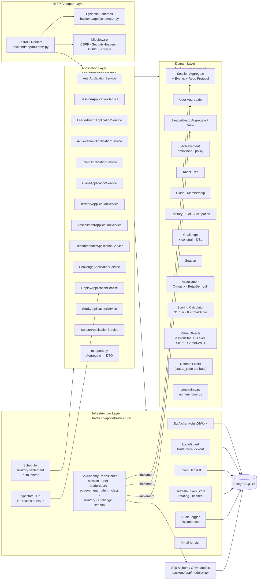
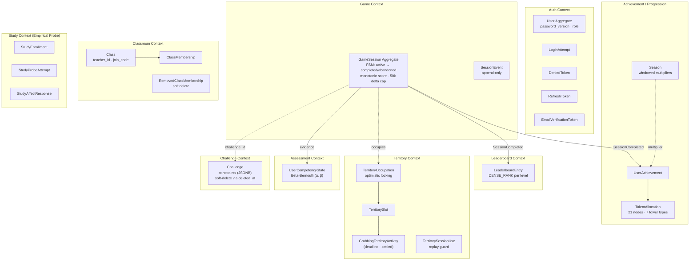
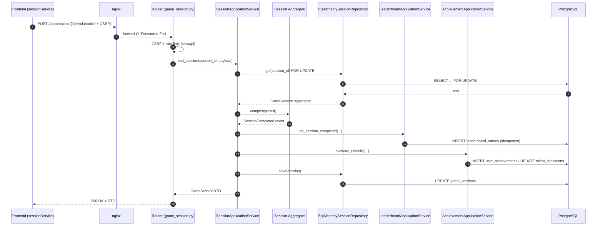
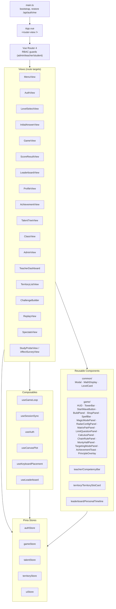
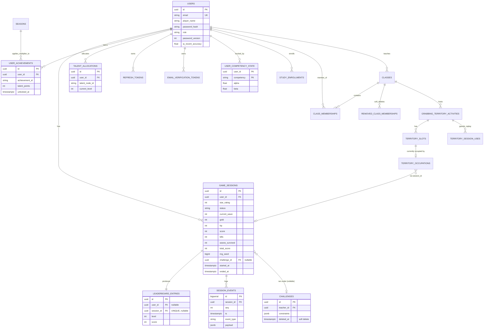
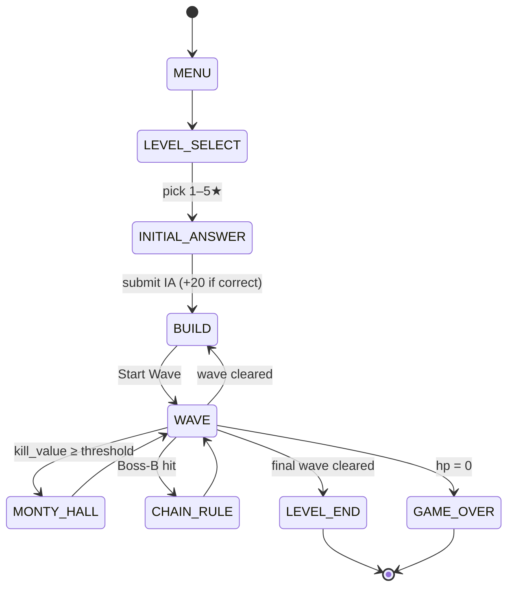
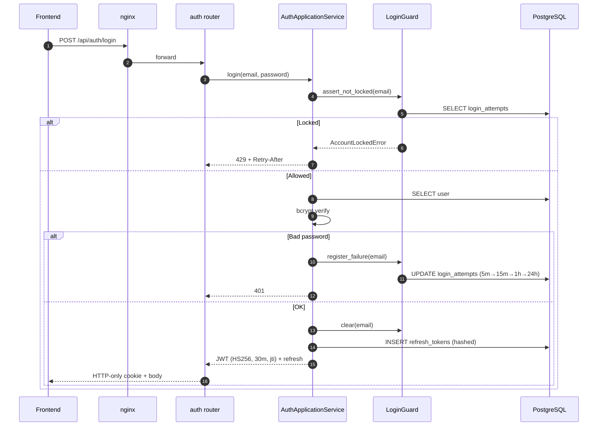
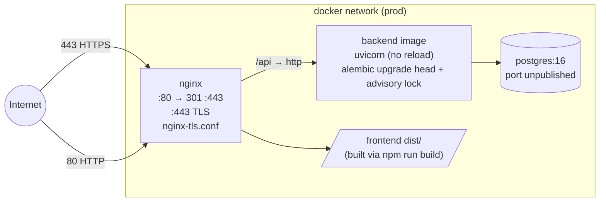

# Math Defense — System Architecture

> Comprehensive architecture reference for the Math Defense educational tower-defense game.
> Generated 2026-05-08 from a full audit of source, schema, and deployment configuration.

This document describes the system from four complementary angles:

1. **High-level topology** — what runs where, how the tiers connect.
2. **Backend (FastAPI, DDD)** — domain → application → infrastructure → HTTP.
3. **Frontend (Vue 3 + pure-TS engine + WASM)** — UI shell, ECS-style systems, rendering.
4. **Cross-cutting** — auth/security, persistence, deployment, build, testing.

All diagrams use [Mermaid](https://mermaid.js.org/). Render directly in GitHub, VS Code, or any Mermaid-aware viewer.

---

## 1. Top-Level Layout

| Path | Role |
|---|---|
| `frontend/` | Vue 3 + Vite SPA. Pure-TS game engine, ECS-style systems, Pinia stores, ~41 Vitest files. |
| `backend/` | FastAPI service with DDD layering, SQLAlchemy ORM, Alembic migrations, ~315 pytest tests. |
| `wasm/` | C99 math kernel compiled to WebAssembly via Emscripten (9 exported functions). |
| `emsdk/` | Vendored Emscripten SDK (no rebuild required unless updating compiler). |
| `shared/` | `game-constants.json` — single source of truth for canvas/grid/economy values. |
| `assets/` | Sprites, audio, fonts (referenced as `frontend/public/`). |
| `docs/` | Project documentation (this file lives here). |
| `docker-compose.yml` | Dev orchestration: Postgres + backend (hot reload) + Vite dev server. |
| `docker-compose.prod.yml` | Production: self-contained images, nginx + TLS termination. |
| `nginx.conf`, `nginx-tls.conf` | SPA fallback + `/api` reverse proxy + CSP headers. |
| `Math_Defense_Spec.md` | V1 design spec (superseded but retained for V2 lineage). |
| `DATABASE_SCHEMA.md` | Full ERD: 30+ tables, constraints, indexes, migration history. |
| `SECURITY.md` | Auth flow, JWT/bcrypt, lockout, MFA, CSRF, CSP, audit logging. |

---

## 2. System Topology


**Key boundaries**

- **Browser ↔ Nginx**: HTTPS only in production; nginx handles TLS, CORS allow-list, security headers, SPA fallback.
- **Nginx ↔ FastAPI**: Plain HTTP on the docker network; no TLS inside the perimeter.
- **FastAPI ↔ Postgres**: psycopg v3 (`postgresql+psycopg://`); Alembic upgrade serialized via advisory lock at startup.
- **Shared constants**: `shared/game-constants.json` consumed by both frontend (Vite import) and backend (`test_shared_constants_parity.py` enforces drift detection).

---

## 3. Backend Architecture (FastAPI + DDD)

### 3.1 Layered View



**Layering rules**

- **Domain** has zero imports from FastAPI, Pydantic, or SQLAlchemy. Repository interfaces are `typing.Protocol`s.
- **Application** orchestrates use cases and accepts repository protocols via constructor (DI). Mappers convert aggregates to Pydantic DTOs at the boundary.
- **Infrastructure** is the only place SQLAlchemy lives. Repositories implement the domain protocols. `SqlAlchemyUnitOfWork` is a context manager with explicit `.commit()` and auto-rollback.
- **Routers** are thin: validate input, call one application method, return DTO. Domain errors carry `status_code`; a global exception handler maps them to HTTP responses (so routers never translate exceptions).

### 3.2 Bounded Contexts and Aggregates



**Domain events (lite event sourcing)**

`GameSession` emits `SessionCreated`, `SessionUpdated`, `SessionCompleted`, `SessionAbandoned`. Within a single Unit of Work, `SessionApplicationService` consumes `SessionCompleted` to:

1. Create a `LeaderboardEntry` (idempotent via `UNIQUE(session_id)`).
2. Run `AchievementApplicationService.evaluate_unlocks(...)` and award talent points.
3. Update `UserCompetencyState` (Beta-Bernoulli posteriors per Q-matrix evidence).
4. Update `User.ia_recent_accuracy` (rolling 10-session fraction).
5. Accumulate study dosage if user is enrolled.

If any consumer fails, the UoW rolls back — leaderboard, achievements, and competency state stay consistent with session state.

### 3.3 Request Lifecycle (example: end-of-session POST)



### 3.4 Routers (HTTP Surface)

| Router | Mount | Highlights |
|---|---|---|
| `auth.py` | `/api/auth` | register, login, logout, me, refresh; CSRF + lockout-aware |
| `game_session.py` | `/api/sessions` | create, active, patch, end, abandon |
| `leaderboard.py` | `/api/leaderboard` | DENSE_RANK per star, manual submit, personal timeline |
| `achievement.py` | `/api/achievements` | list, summary |
| `talent.py` | `/api/talents` | tree, modifiers, allocate, reset |
| `class_.py` | `/api/classes` | CRUD, join-by-code, student management |
| `admin.py` | `/api/admin` | teacher / class / student listings (RBAC) |
| `territory.py` | `/api/activities` | activities, slot play, rankings, settlement |
| `assessment.py` | `/api/assessment` | per-class posteriors (teacher dashboard) |
| `recommendation.py` | `/api/recommendation` | adaptive star + next talent node |
| `challenge.py` | `/api/challenges` | constraint DSL CRUD, soft-delete |
| `replay.py` | `/api/sessions/{id}/events`, `/replay`, `/spectate` (WS) | append-only event log + live spectate |
| `study.py` | `/api/study` | enroll, probe, affect, CSV export |
| `season.py` | `/api/seasons` | windowed multipliers (admin) |

Cross-cutting: `slowapi` rate limits per endpoint, `CsrfMiddleware` (double-submit cookie), `SecurityHeadersMiddleware` (X-Content-Type-Options, X-Frame-Options, Referrer-Policy, Permissions-Policy, no-store on `/api/auth`), `CORSMiddleware` (explicit allow-list, mirrored in nginx for production).

---

## 4. Frontend Architecture

### 4.1 Vue Shell + Pinia + Router



### 4.2 Game Engine (pure TypeScript, ECS-inspired)

```mermaid
flowchart TB
    subgraph Core["Engine Core (frontend/src/engine/)"]
        Game["Game.ts<br/>fixed-timestep 60 FPS loop<br/>owns GameState"]
        State["GameState.ts<br/>(phase · level · gold · hp ·<br/>score · kills · waves_survived ·<br/>kill_value · cost_total · time_total)"]
        FSM["PhaseStateMachine<br/>transition table"]
        Bus["EventBus<br/>type-safe pub/sub"]
        Input["InputManager"]
        Renderer["Renderer (Canvas 2D primitives)"]
        Game --> State
        Game --> FSM
        Game --> Bus
        Game --> Input
        Game --> Renderer
    end

    subgraph Systems["ECS-style Systems"]
        TPS[TowerPlacementSystem]
        TUS[TowerUpgradeSystem]
        CS[CombatSystem]
        EAS[EnemyAbilitySystem]
        MGS[MagicTowerSystem]
        RTS[RadarTowerSystem]
        MTS[MatrixTowerSystem]
        LTS[LimitTowerSystem]
        CTS[CalculusTowerSystem]
        MS[MovementSystem]
        WS[WaveSystem]
        BS[BuffSystem]
        SpS[SpellSystem]
        MHS[MontyHallSystem]
        ES[EconomySystem]
    end

    subgraph DomainPolicies["domain/* (pure rules)"]
        SP[SplitPolicy]
        LG[level-generator · distractor · decoy]
        LLS[level-layout-service]
        PP[placement-policy · legal-positions]
        MoveS[movement-strategy]
        Path[curve-path · segmented-path · path-builder · validator]
        Score[score-calculator (mirror of backend)]
    end

    subgraph Math["math/ (frontend/src/math)"]
        Bridge["WasmBridge.ts<br/>RAII float buffers · JS fallback"]
        Wasm[("math_engine.wasm<br/>9 exported C functions")]
        Utils[MathUtils · RandomUtils · curve-evaluator ·<br/>intersection-solver · limit-evaluator ·<br/>chain-rule-generator · expressionParser]
    end

    subgraph Renderers["renderers/"]
        ER[EnemyRenderer]
        TR[TowerRenderer]
        PR[ProjectileRenderer]
        MZR[MagicZoneRenderer]
        RRR[RadarRangeRenderer]
        MLR[MatrixLaserRenderer]
        PetR[PetRenderer]
        SER[SpellEffectRenderer]
    end

    subgraph Replay["replay/"]
        Recorder[EventRecorder<br/>batched flush]
        Player[EventPlayer<br/>deterministic replay]
        Spectator[SpectatorClient<br/>WebSocket]
    end

    Game --> Systems
    Systems --> DomainPolicies
    Systems --> Math
    Game --> Renderers
    Bridge --> Wasm
    Bridge --> Utils
    Game --> Replay
```

**Engine isolation**: `engine/` and `domain/` directories have **zero Vue imports**. They are pure TS, drive a `Game` instance, and expose hooks. The Vue shell binds them via `useGameLoop` (mount/unmount, talent modifier injection) and `useSessionSync` (lifecycle ↔ backend session API).

### 4.3 Service Layer

| Service | Endpoint family |
|---|---|
| `api.ts` | base fetch wrapper, Bearer auto-attach, throws `ApiError` |
| `authService` | `/api/auth/*` |
| `sessionService` | `/api/sessions/*` |
| `leaderboardService` | `/api/leaderboard/*` |
| `achievementService`, `seasonService` | `/api/achievements/*`, `/api/seasons/*` |
| `talentService` | `/api/talents/*` |
| `classService`, `adminService` | `/api/classes/*`, `/api/admin/*` |
| `territoryService` | `/api/activities/*` |
| `assessmentService`, `recommendationService` | `/api/assessment/*`, `/api/recommendation/*` |
| `challengeService` | `/api/challenges/*` |
| `studyService` | `/api/study/*` |

---

## 5. WebAssembly Math Kernel

C99 sources in `wasm/`, compiled by Emscripten (`wasm/Makefile`) to `frontend/src/math/wasm/math_engine.{js,wasm,d.ts}`. The bridge layer (`WasmBridge.ts`) provides:

- **RAII float-buffer helpers** that allocate via `malloc`, hand a typed view to the caller, and `free` on disposal.
- **JS fallbacks** for every export, gated by `setUseWasm(false)` for diagnostics.
- **Parity tests** in Vitest verify WASM and JS implementations agree numerically.

| Export | Use in game |
|---|---|
| `matrix_multiply` | Matrix tower (paired-tower transform) |
| `sector_coverage`, `point_in_sector` | Radar A/B/C arc / hit-test |
| `numerical_integrate` | Calculus tower integral picker |
| `calculate_trajectory`, `fourier_composite`, `fourier_match`, `line_circle_intersect` | V1 legacy systems retained for replay compatibility |
| `malloc`, `free` | Bridge memory plumbing |

`ALLOW_MEMORY_GROWTH=1`, `MAXIMUM_MEMORY=256MiB`. Single linear heap.

---

## 6. Database Schema (Logical View)

> Authoritative reference: `DATABASE_SCHEMA.md`. The diagram below shows the principal entities and FK relationships.



**Notable schema features**

- Partial unique index `uq_one_active_per_user WHERE status='active'` enforces "at most one active session per user" without blocking completed/abandoned rows.
- `LeaderboardEntry.session_id` is `UNIQUE` so the post-completion projection is naturally idempotent.
- `SessionEvent` is append-only with `UNIQUE(session_id, seq)` — clients can safely retry batched flushes.
- `audit_logs` deliberately has **no FK on `user_id`** so audit history survives user deletion; written via an isolated SQLAlchemy session that survives the surrounding transaction's rollback.
- `challenges.deleted_at` (soft delete) lets historical leaderboard rows still resolve `challenge_id` after a teacher archives a challenge.
- Composite-PK Beta-Bernoulli posteriors (`UserCompetencyState`) — the math engine for stealth assessment.

---

## 7. Game Domain & Mechanics

### 7.1 Game-State FSM



### 7.2 Towers (V2)

| Tower | Concept | Mechanic |
|---|---|---|
| **Magic** | Polynomial / Trig / Log curves | Function-curve overlay zone; debuffs enemies, buffs nearby towers |
| **Radar A** | Trigonometry & sectors | Continuous arc-sweep AoE |
| **Radar B** | Polar coordinates | Single-target fast follow-fire |
| **Radar C** | Angular momentum | Slow, high-damage projectiles |
| **Matrix** | Linear transforms | Paired towers; laser between pair, dot-product damage |
| **Limit** | Limits (lim x→·) | Multiple-choice question sets effective range (∞ / -∞ / 0) |
| **Calculus** | Derivatives & integrals | Player-defined function spawns autonomous Pet projectiles |

### 7.3 Enemies

Normal · Fast · Tank · Split · Invisible · Boss-A (airborne, spawns minions) · Boss-B (chain-rule trigger; splits on death).

### 7.4 Progression Systems

| System | Mechanism | Persistence |
|---|---|---|
| Achievements | 20 definitions across 5 categories | `user_achievements` (talent points awarded) |
| Talent Tree | 21 nodes / 7 tower types / prereq chains | `talent_allocations` |
| Seasons | Time-windowed multipliers on talent points | `seasons` |
| Leaderboard | Per-star DENSE_RANK + global rank | `leaderboard_entries` |
| Grabbing Territory | Teacher activity, students seize slots by score | `territory_*` (optimistic locking) |
| Stealth Assessment | Beta-Bernoulli posteriors per Q-matrix evidence | `user_competency_state` |
| Empirical Validity Probe | A/B groups; pre/post/delay forms; affect surveys | `study_*` (CSV export for analysis) |

---

## 8. Authentication & Security

### 8.1 Token Lifecycle



### 8.2 Defenses at a glance

- **Password storage**: bcrypt; minimum length and char-class checks.
- **Access tokens**: HS256 JWT, 30-minute TTL, claims include `sub`, `jti`, `password_version` (changing password globally invalidates outstanding tokens).
- **Refresh tokens**: rotating; SHA-256 hashed at rest; `used` flag flips on rotation; `revoked` flag for logout-all.
- **Token denylist**: `denied_tokens.jti` set on logout; pruned at natural expiry by the auth janitor (every 10 min).
- **Brute-force lockout**: per-account 5 failures / 5 min → 5m, 15m, 1h, 24h backoff. Returns `429` + `Retry-After`.
- **CSRF**: double-submit cookie + `X-CSRF-Token` header on unsafe methods (opt-out only under pytest/CI).
- **Rate limiting**: slowapi per route (auth tighter than gameplay endpoints).
- **MFA**: optional TOTP, with step-replay guard via `totp_last_used_at`.
- **Audit log**: `record_audit_event()` writes via an isolated session so it survives the outer transaction's rollback; no FK on `user_id`.
- **Headers** (nginx + middleware): CSP, X-Frame-Options DENY, X-Content-Type-Options nosniff, Referrer-Policy strict-origin-when-cross-origin, Permissions-Policy disabling camera/mic/geolocation/payment, no-store on `/api/auth`.

---

## 9. Build & Deployment

### 9.1 Development

```bash
docker-compose up
# Frontend (Vite dev server with HMR): http://localhost:5173
# Backend (uvicorn --reload):           http://localhost:8000
# Postgres:                             127.0.0.1:5432 (host-mapped, dev only)
```

`docker-compose.yml` bind-mounts `frontend/`, `backend/`, and `shared/` for hot reload.

### 9.2 Production

```bash
docker-compose -f docker-compose.prod.yml up --build -d
```



**Production differences vs dev**

- Self-contained images (no source bind-mounts).
- Frontend built with `npm run build`; nginx serves the `dist/`.
- Postgres port unpublished; only reachable on the docker network.
- TLS termination via `nginx-tls.conf` with certs mounted read-only at `/etc/nginx/certs/`.
- `:80 → :443` 301 redirect.
- CORS allow-list driven by env vars (`CORS_ORIGIN_1`, `CORS_ORIGIN_2`).
- Alembic upgrade serialised across replicas via a Postgres advisory lock at startup.

### 9.3 Background workers

- **Territory settlement** — 5-second poll job calls `TerritoryApplicationService.settle_activity(...)` for activities past their deadline.
- **Auth-store janitor** — 10-minute purge of expired denylist / refresh tokens.
- **Spectate hub** — in-process pub/sub for `/api/sessions/{id}/spectate` WebSocket fan-out (bounded queue per subscriber).

All scheduled inside the FastAPI lifespan as asyncio tasks (`backend/app/infrastructure/scheduler.py`).

---

## 10. Testing Strategy

### Backend (pytest, ~315 tests)

- **Domain unit tests** — pure aggregate logic, value objects, invariants (no DB).
- **Repository / integration tests** — real Postgres, TRUNCATE-per-test isolation, async-capable via pytest-asyncio.
- **Router tests** — FastAPI TestClient end-to-end (auth, RBAC, rate-limit headers).
- **Cross-cutting tests** — shared-constants parity, score recomputation vs client claim, audit-driven coverage gaps (negative HP, score regress, > 50k delta).

### Frontend (Vitest + happy-dom, ~41 files)

- Engine systems, GameState and PhaseStateMachine.
- Domain policies (split, level-generator, path-validator, placement-policy).
- Movement / path / spawn / projection.
- WASM ↔ JS parity for every exported function.
- Replay determinism (EventPlayer reproduces final state from `rng_seed` + recorded events).
- Score calculator parity with backend.
- Audio AssetManager, keyboard placement (WCAG 2.1.1).

---

## 11. Cross-Cutting Architectural Decisions

| Decision | Rationale |
|---|---|
| Domain errors carry HTTP `status_code` | Routers stay thin; one global exception handler maps to responses. |
| Repository **protocols** (not inheritance) | Domain free of ORM; in-memory test doubles are trivial. |
| Lite event sourcing for sessions | `SessionCompleted` consumers (leaderboard, achievements, competency, study) participate in the same UoW so consistency is atomic. |
| Append-only `session_events` | Replay and live spectate need a deterministic, immutable record. |
| Partial unique index on active session | "At most one active session per user" without blocking completed rows. |
| Rotating refresh tokens, hashed | Compromise window bounded; reuse of a `used` token is detectable. |
| JWT denylist (not full revocation list) | Rows pruned at natural expiry — lighter than tracking every token. |
| WASM with parity-tested JS fallback | Hot-path performance plus graceful degradation. |
| `shared/game-constants.json` | Canvas, grid, economy values consumed by both sides; parity test prevents drift. |
| Optimistic locking on territory occupation | Concurrent slot grabs fail loudly so the client can retry. |
| Soft delete for challenges | Historical leaderboard entries still resolve `challenge_id`. |
| Practice-mode flag on session | Lets students drill without polluting leaderboards; achievements/talents still award. |
| Reflection text post-session | Articulation prompt; logged but not scored. |
| Bayesian competency state | Stealth assessment without explicit probes per session; informs adaptive recommendations. |
| Scoring duplicated client and server | Server is canonical for anti-cheat; client mirror keeps UX live. |

---

## 12. File Map (cheat sheet)

```
backend/
  app/
    main.py                      # FastAPI app + lifespan (alembic, scheduler)
    factories.py                 # ServiceContainer DI wiring
    domain/                      # aggregates, value objects, errors, policies
      session/   user/   leaderboard/   achievement/   talent/   class_/
      territory/   challenge/   season/   assessment/   study/   scoring/
      value_objects.py   constraints.py   errors.py
    application/                 # use-case services + mappers.py
    infrastructure/
      persistence/               # SqlAlchemy*Repository
      unit_of_work.py
      login_guard.py   token_denylist.py   refresh_token_store.py
      audit_logger.py   email_service.py   scheduler.py   spectate_hub.py
    models/                      # SQLAlchemy ORM models (20)
    routers/                     # FastAPI routers (thin adapters)
    schemas/                     # Pydantic DTOs
  alembic/                       # migrations
  tests/                         # ~315 pytest tests

frontend/
  src/
    main.ts   App.vue
    router/                      # RBAC-aware routes
    stores/                      # Pinia: auth, game, talent, territory, ui
    views/                       # page-level components
    components/                  # common, game, teacher, territory, leaderboard
    composables/                 # useGameLoop, useSessionSync, useAuth, ...
    services/                    # api.ts + per-domain clients
    engine/                      # Game.ts, GameState, PhaseStateMachine,
                                 # systems/, renderers/, replay/, domain/
    math/                        # WasmBridge, MathUtils, evaluators, wasm/
    entities/                    # Tower/Enemy/Projectile/Pet types + factories
    data/                        # tower-defs, enemy-defs, level-defs, ...
  tests/                         # Vitest suites

wasm/                            # C99 sources + Makefile (Emscripten)
emsdk/                           # vendored toolchain
shared/game-constants.json       # parity-tested constants
docs/                            # this file + analysis docs
docker-compose.yml               # dev
docker-compose.prod.yml          # prod
nginx.conf  nginx-tls.conf       # reverse proxy + TLS
DATABASE_SCHEMA.md   SECURITY.md   Math_Defense_Spec.md   README.md
```

---

*End of architecture reference. Update this file when domain boundaries, persistence, or deployment topology change. Use the matching parity tests (`backend/tests/test_shared_constants_parity.py`, WASM/JS parity in Vitest) to enforce the cross-cutting invariants this document depends on.*
