# Database Schema Reference

**Engine**: PostgreSQL (psycopg v3 — `postgresql+psycopg` URL scheme)  
**ORM**: SQLAlchemy 2.x (declarative `Base`)  
**Migrations**: Alembic (`backend/alembic/`)  
**All PKs**: UUID stored as `String`, generated via `str(uuid.uuid4())`  
**All timestamps**: `DateTime(timezone=True)`, UTC

---

## Entity-Relationship Diagram

```mermaid
erDiagram
    users {
        string  id              PK  "UUID"
        string  username            "UNIQUE, nullable"
        string  email           UK  "NOT NULL"
        string  player_name         "NOT NULL"
        string  avatar_url          "nullable"
        string  role                "enum: admin|teacher|student, DEFAULT student"
        boolean is_active           "DEFAULT true"
        string  password_hash       "NOT NULL"
        int     password_version    "DEFAULT 0"
        boolean is_email_verified   "DEFAULT false"
        string  totp_secret         "nullable — Fernet ciphertext, ≤255 chars"
        boolean mfa_enabled         "DEFAULT false"
        datetime totp_last_used_at  "nullable — TOTP replay guard"
        float   ia_recent_accuracy  "DEFAULT 0.0; CHECK 0–1 — last-10 IA fraction"
        datetime created_at
        datetime updated_at         "auto-update"
    }

    classes {
        string  id          PK  "UUID"
        string  name            "NOT NULL"
        string  teacher_id  FK  "→ users.id RESTRICT"
        string  join_code    UK  "8-char UPPER"
        string  description     "nullable, ≤500"
        string  subject         "nullable, ≤80"
        string  school_year     "nullable, ≤40"
        int     capacity        "nullable, CHECK > 0"
        string  color           "nullable, ≤16"
        string  icon            "nullable, ≤40"
        datetime archived_at    "nullable — soft-delete"
        datetime created_at
    }

    class_co_teachers {
        string  id          PK  "UUID"
        string  class_id    FK  "→ classes.id CASCADE"
        string  teacher_id  FK  "→ users.id CASCADE"
        datetime added_at
    }

    class_pending_invites {
        string  id          PK  "UUID"
        string  class_id    FK  "→ classes.id CASCADE"
        string  email           "≤320, UNIQUE per class"
        datetime invited_at
    }

    class_groups {
        string  id          PK  "UUID"
        string  class_id    FK  "→ classes.id CASCADE"
        string  name            "≤80, UNIQUE per class"
        string  color           "nullable, ≤16"
        datetime created_at
    }

    class_group_members {
        string  group_id    PK,FK "→ class_groups.id CASCADE — composite PK"
        string  student_id  PK,FK "→ users.id CASCADE — composite PK"
        string  class_id    FK    "→ classes.id CASCADE — UNIQUE(class_id, student_id)"
        datetime joined_at
    }

    class_memberships {
        string  id          PK  "UUID"
        string  class_id    FK  "→ classes.id CASCADE"
        string  student_id  FK  "→ users.id CASCADE"
        datetime joined_at
    }

    game_sessions {
        string  id                   PK  "UUID"
        string  user_id              FK  "→ users.id CASCADE"
        string  challenge_id         FK  "→ challenges.id SET NULL, nullable"
        int     star_rating              "CHECK 1–5"
        json    path_config              "nullable"
        boolean initial_answer           "DEFAULT false"
        boolean practice_mode            "DEFAULT false — excluded from leaderboard"
        boolean is_preview               "DEFAULT false — teacher/admin run, excluded from leaderboard"
        string  status                   "enum: active|completed|abandoned"
        int     current_wave             "DEFAULT 0"
        int     gold                     "DEFAULT INITIAL_GOLD (200)"
        int     hp                       "DEFAULT 20"
        int     score                    "DEFAULT 0"
        int     kills                    "DEFAULT 0"
        int     waves_survived           "DEFAULT 0"
        int     kill_value               "nullable"
        float   time_total               "nullable"
        int     cost_total               "nullable"
        int     health_origin            "nullable"
        int     health_final             "nullable"
        json    time_exclude_prepare     "nullable"
        float   total_score              "nullable"
        string  reflection_text          "nullable, ≤2000 chars"
        bigint  rng_seed                 "nullable — replay determinism seed"
        smallint replay_version          "DEFAULT 1 — 1=mulberry32+JS Math, 2=PCG+WASM bit-exact"
        datetime started_at
        datetime ended_at                "nullable"
    }

    leaderboard_entries {
        string  id             PK  "UUID"
        string  user_id        FK  "→ users.id SET NULL"
        int     level              "CHECK 1–5"
        int     score
        int     kills
        int     waves_survived
        float   total_score        "nullable — V2 floating-point score"
        string  session_id     FK  "→ game_sessions.id SET NULL, UNIQUE"
        string  challenge_id   FK  "→ challenges.id CASCADE, nullable"
        datetime created_at
    }

    user_achievements {
        string  id             PK  "UUID"
        string  user_id        FK  "→ users.id CASCADE"
        string  achievement_id     "NOT NULL"
        int     talent_points      "DEFAULT 0"
        datetime unlocked_at
    }

    talent_allocations {
        string  id             PK  "UUID"
        string  user_id        FK  "→ users.id CASCADE"
        string  talent_node_id     "NOT NULL"
        int     current_level      "DEFAULT 1, CHECK >= 1"
        datetime updated_at        "auto-update"
    }

    grabbing_territory_activities {
        string  id          PK  "UUID"
        string  class_id    FK  "→ classes.id CASCADE, nullable"
        string  teacher_id  FK  "→ users.id CASCADE"
        string  title           "NOT NULL"
        datetime deadline
        boolean settled         "DEFAULT false"
        datetime settled_at     "nullable"
        string  settled_by  FK  "→ users.id SET NULL"
        datetime created_at
    }

    territory_slots {
        string  id           PK  "UUID"
        string  activity_id  FK  "→ grabbing_territory_activities.id CASCADE"
        int     star_rating      "CHECK 1–5"
        json    path_config      "nullable"
        int     slot_index       "CHECK >= 0, UNIQUE per activity"
    }

    territory_occupations {
        string  id          PK  "UUID"
        string  slot_id     FK  "→ territory_slots.id CASCADE, UNIQUE"
        string  student_id  FK  "→ users.id CASCADE"
        float   score
        string  session_id  FK  "→ game_sessions.id SET NULL, UNIQUE"
        datetime occupied_at
    }

    territory_session_uses {
        string  session_id  PK,FK  "→ game_sessions.id CASCADE — replay-guard while session exists"
    }

    territory_rankings_snapshot {
        string  id              PK  "UUID"
        string  activity_id     FK  "→ grabbing_territory_activities.id CASCADE"
        string  student_id      FK  "→ users.id CASCADE"
        float   territory_value
        int     rank
        datetime snapshot_at
    }

    removed_class_memberships {
        string  id          PK  "UUID"
        string  class_id    FK  "→ classes.id CASCADE"
        string  student_id  FK  "→ users.id CASCADE"
        datetime removed_at
    }

    login_attempts {
        string  username         PK  "NOT NULL"
        int     failures             "DEFAULT 0"
        datetime window_started_at
        datetime locked_until        "nullable"
        int     lockout_count        "DEFAULT 0 — exponential-backoff counter"
    }

    refresh_tokens {
        string  id          PK  "UUID"
        string  user_id     FK  "→ users.id CASCADE"
        string  token_hash  UK  "64-char SHA-256 hex"
        datetime expires_at
        boolean used            "DEFAULT false"
        boolean revoked         "DEFAULT false"
    }

    user_competency_state {
        string  user_id     PK,FK "→ users.id CASCADE — composite PK"
        string  competency  PK    "32-char domain code — composite PK"
        float   alpha             "Beta posterior; DEFAULT 1.0"
        float   beta              "Beta posterior; DEFAULT 1.0"
        datetime updated_at       "auto-update"
    }

    seasons {
        string  season_id   PK   "≤64-char slug"
        string  name             "NOT NULL"
        datetime starts_at
        datetime ends_at         "CHECK ends_at > starts_at"
        datetime created_at
    }

    challenges {
        string  id          PK   "UUID"
        string  teacher_id  FK   "→ users.id CASCADE"
        string  title            "≤120 chars"
        string  description      "≤500 chars; DEFAULT ''"
        jsonb   constraints      "Serialised ChallengeConstraints DSL"
        datetime created_at
        datetime updated_at
        datetime deleted_at      "nullable — soft delete"
    }

    session_events {
        bigint  id          PK   "BIGSERIAL"
        string  session_id  FK   "→ game_sessions.id CASCADE"
        int     seq              "monotonic per session; UNIQUE(session_id, seq)"
        float   ts               "game-time seconds since startLevel"
        string  event_type       "≤64 chars"
        jsonb   payload          "nullable — GameEvents shape"
        datetime created_at
    }

    study_enrollments {
        string  user_id        PK,FK "→ users.id CASCADE — composite PK"
        string  study_id       PK    "≤64-char study slug — composite PK"
        string  group               "single char A|B"
        int     dosage_seconds      "DEFAULT 0 — cumulative play time"
        datetime enrolled_at
    }

    study_probe_attempts {
        int     id          PK   "BIGSERIAL"
        string  user_id     FK   "→ users.id CASCADE"
        string  study_id         "≤64 chars"
        string  form             "pre|post|delay; UNIQUE(user_id, study_id, form)"
        int     score            "0–10"
        jsonb   responses        "per-item record"
        datetime submitted_at
    }

    study_affect_responses {
        int     id          PK   "BIGSERIAL"
        string  user_id     FK   "→ users.id CASCADE"
        string  study_id         "≤64 chars"
        string  phase            "pre|post; UNIQUE(user_id, study_id, phase)"
        float   anxiety_mean     "Likert mean ∈ [1,5]"
        float   motivation_mean  "Likert mean ∈ [1,5]"
        jsonb   responses        "raw item Likerts"
        datetime submitted_at
    }

    denied_tokens {
        string  jti         PK  "64-char"
        datetime expires_at
    }

    email_verification_tokens {
        string  id          PK  "UUID"
        string  user_id     FK  "→ users.id CASCADE"
        string  token       UK  "64-char"
        datetime expires_at
        boolean used            "DEFAULT false"
    }

    audit_logs {
        string  id          PK  "UUID"
        string  user_id         "nullable (no FK — survives user deletion)"
        string  event_type      "NOT NULL, indexed"
        string  ip_address      "nullable"
        text    user_agent      "nullable"
        text    details         "nullable"
        datetime created_at
    }

    %% ── Core user associations ──────────────────────────────────────────────
    users                           ||--o{ classes                         : "teaches (teacher_id)"
    users                           ||--o{ class_memberships               : "member_of (student_id)"
    users                           ||--o{ game_sessions                   : "plays (user_id)"
    users                           |o--o{ leaderboard_entries             : "scored (user_id)"
    users                           ||--o{ user_achievements               : "earns (user_id)"
    users                           ||--o{ talent_allocations              : "allocates (user_id)"
    users                           ||--o{ territory_occupations           : "occupies (student_id)"
    users                           ||--o{ removed_class_memberships       : "removed_from (student_id)"
    users                           ||--o{ email_verification_tokens       : "verifies_via (user_id)"
    users                           ||--o{ refresh_tokens                  : "rotates (user_id)"
    users                           ||--o{ user_competency_state           : "knows (user_id)"
    users                           ||--o{ challenges                      : "authors (teacher_id)"
    users                           ||--o{ study_enrollments               : "enrolls (user_id)"
    users                           ||--o{ study_probe_attempts            : "submits (user_id)"
    users                           ||--o{ study_affect_responses          : "rates (user_id)"

    %% ── Challenge mode ──────────────────────────────────────────────────────
    challenges                      |o--o{ game_sessions                   : "scoped (challenge_id)"
    challenges                      |o--o{ leaderboard_entries             : "ranks (challenge_id)"

    %% ── Replay / spectate ───────────────────────────────────────────────────
    game_sessions                   ||--o{ session_events                  : "recorded (session_id)"

    %% ── Territory activity authorship & settlement ──────────────────────────
    users                           ||--o{ grabbing_territory_activities   : "creates (teacher_id)"
    users                           |o--o{ grabbing_territory_activities   : "settles (settled_by)"

    %% ── Class associations ──────────────────────────────────────────────────
    classes                         ||--o{ class_memberships               : "enrolls (class_id)"
    classes                         |o--o{ grabbing_territory_activities   : "hosts (class_id)"
    classes                         ||--o{ removed_class_memberships       : "removal_log (class_id)"
    classes                         ||--o{ class_co_teachers               : "co-taught (class_id)"
    classes                         ||--o{ class_pending_invites           : "pre-invites (class_id)"
    classes                         ||--o{ class_groups                    : "groups (class_id)"
    class_groups                    ||--o{ class_group_members             : "members (group_id)"
    users                           ||--o{ class_co_teachers               : "co-teaches (teacher_id)"
    users                           ||--o{ class_group_members             : "grouped (student_id)"

    %% ── Session → scoring/territory (one session → 0 or 1) ─────────────────
    game_sessions                   |o--o| leaderboard_entries             : "logged_as (session_id)"
    game_sessions                   |o--o| territory_occupations           : "used_for (session_id)"

    %% ── Territory hierarchy ─────────────────────────────────────────────────
    grabbing_territory_activities   ||--|{ territory_slots                 : "has (activity_id)"
    territory_slots                 ||--o| territory_occupations           : "occupied_by (slot_id)"
    grabbing_territory_activities   ||--o{ territory_rankings_snapshot     : "snapshots (activity_id)"
    users                           ||--o{ territory_rankings_snapshot     : "ranked (student_id)"
    game_sessions                   ||--o{ territory_session_uses          : "consumed_by (session_id)"
```

---

## Tables — Full Reference

### `users`

Central identity table. Stores authentication credentials, MFA state, and profile data.

| Column | Type | Nullable | Constraints / Default |
|---|---|---|---|
| `id` | `String` (UUID) | NO | PK |
| `username` | `String(50)` | YES | UNIQUE |
| `email` | `String(255)` | NO | UNIQUE |
| `player_name` | `String(50)` | NO | — |
| `avatar_url` | `String(500)` | YES | — |
| `role` | `Enum` | NO | `admin \| teacher \| student`; DEFAULT `student` |
| `is_active` | `Boolean` | NO | DEFAULT `true` |
| `password_hash` | `String(255)` | NO | — |
| `password_version` | `Integer` | NO | DEFAULT `0` |
| `is_email_verified` | `Boolean` | NO | DEFAULT `false` |
| `totp_secret` | `String(255)` | YES | Widened from `String(64)` in `a1_widen_totp` to fit Fernet ciphertext |
| `mfa_enabled` | `Boolean` | NO | DEFAULT `false` |
| `totp_last_used_at` | `DateTime(tz)` | YES | TOTP step-replay guard — set on every accepted code |
| `ia_recent_accuracy` | `Float` | NO | SERVER DEFAULT `0.0`; `CHECK(0.0 ≤ ia_recent_accuracy ≤ 1.0)` (`ck_user_ia_accuracy_range`). Rolling fraction of last 10 IA-correct sessions; drives Star-1 concrete-fading on the path renderer |
| `created_at` | `DateTime(tz)` | NO | DEFAULT `now()` |
| `updated_at` | `DateTime(tz)` | NO | DEFAULT `now()`; auto-updated on write by a PG `BEFORE UPDATE` trigger (`users_update_timestamp`, created in `b2_fix_h06_h07_h10`) |

**Constraints:** `UNIQUE(username)`, `UNIQUE(email)`, `CHECK(ia_recent_accuracy BETWEEN 0.0 AND 1.0)` (`ck_user_ia_accuracy_range`)  
**Indexes:** None beyond PK + unique columns

---

### `classes`

A classroom created by a teacher. Students join via an 8-character uppercase `join_code`.

| Column | Type | Nullable | Constraints / Default |
|---|---|---|---|
| `id` | `String` (UUID) | NO | PK |
| `name` | `String(100)` | NO | — |
| `teacher_id` | `String` (FK) | NO | → `users.id` ON DELETE **RESTRICT** |
| `join_code` | `String(8)` | NO | UNIQUE; `CHECK (join_code = upper(join_code))` |
| `description` | `String(500)` | YES | Tier-C metadata (`bb2c3d4e5f7a`) |
| `subject` | `String(80)` | YES | Tier-C metadata |
| `school_year` | `String(40)` | YES | Tier-C metadata |
| `capacity` | `Integer` | YES | `CHECK(capacity IS NULL OR capacity > 0)` (`ck_classes_capacity_positive`) |
| `color` | `String(16)` | YES | Tier-C metadata |
| `icon` | `String(40)` | YES | Tier-C metadata |
| `archived_at` | `DateTime(tz)` | YES | NULL = active; non-NULL = soft-archived (audit B2/M1/O8) |
| `created_at` | `DateTime(tz)` | NO | DEFAULT `now()` |

**Constraints:** `UNIQUE(join_code)` (`uq_classes_join_code`), `UNIQUE(teacher_id, name)` (`uq_classes_teacher_name`), `CHECK(join_code = upper(join_code))` (`ck_classes_join_code_upper`), `CHECK(capacity IS NULL OR capacity > 0)` (`ck_classes_capacity_positive`)  
**Indexes:** `ix_classes_teacher_id`, `ix_classes_archived_at`

---

### `class_memberships`

Enrolment join table — maps students to classes. Soft-deleted students are tracked in `removed_class_memberships` instead.

| Column | Type | Nullable | Constraints / Default |
|---|---|---|---|
| `id` | `String` (UUID) | NO | PK |
| `class_id` | `String` (FK) | NO | → `classes.id` ON DELETE **CASCADE** |
| `student_id` | `String` (FK) | NO | → `users.id` ON DELETE **CASCADE** |
| `joined_at` | `DateTime(tz)` | NO | DEFAULT `now()` |

**Constraints:** `UNIQUE(class_id, student_id)` (`uq_class_memberships_class_student`)  
**Indexes:** `ix_class_memberships_student_id`

---

### `class_co_teachers`

Many-to-many supplement: secondary teachers attached to a class. Added by `bb2c3d4e5f7a` for Tier-C class management.

| Column | Type | Nullable | Constraints / Default |
|---|---|---|---|
| `id` | `String` (UUID) | NO | PK |
| `class_id` | `String` (FK) | NO | → `classes.id` ON DELETE **CASCADE** |
| `teacher_id` | `String` (FK) | NO | → `users.id` ON DELETE **CASCADE** |
| `added_at` | `DateTime(tz)` | NO | SERVER DEFAULT `CURRENT_TIMESTAMP` |

**Constraints:** `UNIQUE(class_id, teacher_id)` (`uq_class_co_teachers_class_teacher`)  
**Indexes:** `ix_class_co_teachers_class_id`, `ix_class_co_teachers_teacher_id`

---

### `class_pending_invites`

Pre-registration invites that auto-attach the user to a class on signup. Added by `bb2c3d4e5f7a`.

| Column | Type | Nullable | Constraints / Default |
|---|---|---|---|
| `id` | `String` (UUID) | NO | PK |
| `class_id` | `String` (FK) | NO | → `classes.id` ON DELETE **CASCADE** |
| `email` | `String(320)` | NO | UNIQUE per class |
| `invited_at` | `DateTime(tz)` | NO | SERVER DEFAULT `CURRENT_TIMESTAMP` |

**Constraints:** `UNIQUE(class_id, email)` (`uq_class_invites_class_email`)  
**Indexes:** `ix_class_pending_invites_email`

---

### `class_groups`

Within-class student grouping for group-targeted activities. Added by `bb2c3d4e5f7a`.

| Column | Type | Nullable | Constraints / Default |
|---|---|---|---|
| `id` | `String` (UUID) | NO | PK |
| `class_id` | `String` (FK) | NO | → `classes.id` ON DELETE **CASCADE** |
| `name` | `String(80)` | NO | UNIQUE per class |
| `color` | `String(16)` | YES | — |
| `created_at` | `DateTime(tz)` | NO | SERVER DEFAULT `CURRENT_TIMESTAMP` |

**Constraints:** `UNIQUE(class_id, name)` (`uq_class_groups_class_name`)  
**Indexes:** `ix_class_groups_class_id`

---

### `class_group_members`

Join table — which students belong to which class group. `class_id` is denormalised onto the row so the per-class single-group invariant can fire without joining `class_groups`. Composite PK `(group_id, student_id)`.

| Column | Type | Nullable | Constraints / Default |
|---|---|---|---|
| `group_id` | `String` (FK) | NO | PK component; → `class_groups.id` ON DELETE **CASCADE** |
| `class_id` | `String` (FK) | NO | → `classes.id` ON DELETE **CASCADE** (denormalised for unique check) |
| `student_id` | `String` (FK) | NO | PK component; → `users.id` ON DELETE **CASCADE** |
| `joined_at` | `DateTime(tz)` | NO | SERVER DEFAULT `CURRENT_TIMESTAMP` |

**Constraints:** `PRIMARY KEY(group_id, student_id)`, `UNIQUE(class_id, student_id)` (`uq_group_members_class_student`) — a student may be in at most one group per class  
**Indexes:** `ix_group_members_class_id`, `ix_group_members_student_id`

---

### `game_sessions`

Active and historical game runs. A **partial unique index** (`WHERE status = 'active'`) enforces at most one active session per user.

| Column | Type | Nullable | Constraints / Default |
|---|---|---|---|
| `id` | `String` (UUID) | NO | PK |
| `user_id` | `String` (FK) | NO | → `users.id` ON DELETE **CASCADE** |
| `challenge_id` | `String` (FK) | YES | → `challenges.id` ON DELETE **SET NULL** — non-NULL only when launched from a challenge deep-link |
| `star_rating` | `Integer` | NO | `CHECK (1 ≤ star_rating ≤ 5)` |
| `path_config` | `JSON` | YES | ≤ 10 240 bytes, app-layer validated |
| `initial_answer` | `Boolean` | YES | SERVER DEFAULT `false` (legacy nullable) |
| `practice_mode` | `Boolean` | NO | DEFAULT `false`; SERVER DEFAULT `false`. Set when slider-fallback is in use; the leaderboard query filters these out but achievement/talent awards still fire |
| `is_preview` | `Boolean` | NO | DEFAULT `false`; SERVER DEFAULT `false`. Server-derived from the caller's role at create — true when a teacher or admin plays the game (preview / smoke-test). Same leaderboard-exclusion semantics as `practice_mode`; achievement/talent awards still fire. Clients cannot set this. |
| `status` | `Enum` | NO | `active \| completed \| abandoned`; DEFAULT `active` |
| `current_wave` | `Integer` | NO | DEFAULT `0` |
| `gold` | `Integer` | NO | DEFAULT `INITIAL_GOLD` (200, from `shared/game-constants.json`) |
| `hp` | `Integer` | NO | DEFAULT `20` |
| `score` | `Integer` | NO | DEFAULT `0` |
| `kills` | `Integer` | NO | DEFAULT `0` |
| `waves_survived` | `Integer` | NO | DEFAULT `0` |
| `kill_value` | `Integer` | YES | — |
| `time_total` | `Float` | YES | — |
| `cost_total` | `Integer` | YES | — |
| `health_origin` | `Integer` | YES | — |
| `health_final` | `Integer` | YES | — |
| `time_exclude_prepare` | `JSON` | YES | list of per-wave time floats |
| `total_score` | `Float` | YES | — |
| `reflection_text` | `String(2000)` | YES | Free-text reflection captured after a winning wave (articulation prompt) |
| `rng_seed` | `BigInteger` | YES | Per-session deterministic RNG seed forwarded by the client at session creation; replayed by `EventPlayer` to rebuild the PRNG stream. `BigInteger` because the client emits a 32-bit unsigned value that does not fit in every dialect's `INTEGER`. NULL on legacy rows / clients that do not opt into replay |
| `replay_version` | `SmallInteger` | NO | SERVER DEFAULT `1`. `1` = legacy mulberry32 PRNG + JS `Math.*` transcendentals (ε=5e-4 acceptance); `2` = PCG XSL-RR 64/32 in WASM + musl transcendentals compiled into the .wasm (bit-exact across browsers). Tagged at session creation: client tags `2` only when WASM has loaded; backend `_verify_score` rejects v2 mismatches with HTTP 422 `replay_mismatch` (FU-A) |
| `started_at` | `DateTime(tz)` | NO | DEFAULT `now()` |
| `ended_at` | `DateTime(tz)` | YES | set on completion / abandonment |

**Constraints:** `CHECK(1 ≤ star_rating ≤ 5)` (`ck_game_session_star_range`), `CHECK(score ≥ 0)` (`ck_game_session_score_nonneg`), `CHECK(kills ≥ 0)` (`ck_game_session_kills_nonneg`), `CHECK(waves_survived ≥ 0)` (`ck_game_session_waves_nonneg`), `CHECK(hp ≥ 0)` (`ck_game_session_hp_nonneg`), `CHECK(gold ≥ 0)` (`ck_game_session_gold_nonneg`) — non-negativity checks added in `c3_add_check_constraints`  
**Indexes:** `ix_game_session_user_id`, `ix_game_sessions_challenge_id` (added in `b2_fix_h06_h07_h10`), `uq_one_active_per_user` (partial UNIQUE on `user_id WHERE status = 'active'`)

---

### `leaderboard_entries`

Top scores per user per difficulty level. `user_id` and `session_id` use `SET NULL` so history survives account or session deletion. `challenge_id` uses **CASCADE** (audit B-BUG-4, migration `w7f8a9b0c1d2`): when a challenge is deleted, its leaderboard rows are removed rather than leaking into the global/per-level board, since those rows were scored under challenge-specific wave/score caps.

| Column | Type | Nullable | Constraints / Default |
|---|---|---|---|
| `id` | `String` (UUID) | NO | PK |
| `user_id` | `String` (FK) | YES | → `users.id` ON DELETE **SET NULL** |
| `level` | `Integer` | NO | `CHECK (1 ≤ level ≤ 5)` |
| `score` | `Integer` | NO | — |
| `kills` | `Integer` | NO | — |
| `waves_survived` | `Integer` | NO | — |
| `total_score` | `Float` | YES | M-02 V2 floating-point score (kill_value/time/efficiency/health factors). Rankings prefer this when present and fall back to raw `score` for legacy rows. Added in `b2_fix_h06_h07_h10` |
| `session_id` | `String` (FK) | YES | → `game_sessions.id` ON DELETE **SET NULL**; UNIQUE |
| `challenge_id` | `String` (FK) | YES | → `challenges.id` ON DELETE **CASCADE**; non-NULL when the originating session was launched from a challenge. Per-challenge ranks are served by `query_ranked_by_challenge` so global / per-level boards still work. Cascade ensures deleted challenges do not leak score-capped rows back into the global leaderboard (migration `w7f8a9b0c1d2`) |
| `created_at` | `DateTime(tz)` | NO | DEFAULT `now()` |

**Constraints:** `CHECK(1 ≤ level ≤ 5)` (`ck_leaderboard_level_range`), `UNIQUE(session_id)` (`uq_leaderboard_session_id`)  
**Indexes:** `ix_leaderboard_user_id`, `ix_leaderboard_level_score (level, score)`, `ix_leaderboard_score`, `ix_leaderboard_created_at`, `ix_leaderboard_challenge_id`

---

### `user_achievements`

Tracks which achievement definitions (identified by string `achievement_id`) a user has unlocked, and how many talent points each awarded.

| Column | Type | Nullable | Constraints / Default |
|---|---|---|---|
| `id` | `String` (UUID) | NO | PK |
| `user_id` | `String` (FK) | NO | → `users.id` ON DELETE **CASCADE** |
| `achievement_id` | `String(100)` | NO | — |
| `talent_points` | `Integer` | NO | DEFAULT `0` |
| `unlocked_at` | `DateTime(tz)` | NO | DEFAULT `now()` |

**Constraints:** `UNIQUE(user_id, achievement_id)` (`uq_user_achievement`)  
**Indexes:** `ix_user_achievement_user_id`

---

### `talent_allocations`

Stores the invested level for each talent node per user. Points are derived from `user_achievements.talent_points`.

| Column | Type | Nullable | Constraints / Default |
|---|---|---|---|
| `id` | `String` (UUID) | NO | PK |
| `user_id` | `String` (FK) | NO | → `users.id` ON DELETE **CASCADE** |
| `talent_node_id` | `String(100)` | NO | — |
| `current_level` | `Integer` | NO | DEFAULT `1`; `CHECK(current_level ≥ 1)` |
| `updated_at` | `DateTime(tz)` | NO | DEFAULT `now()`; PG `BEFORE UPDATE` trigger `talent_allocations_update_timestamp` (`b2_fix_h06_h07_h10`) refreshes on every write |

**Constraints:** `UNIQUE(user_id, talent_node_id)` (`uq_user_talent_node`), `CHECK(current_level ≥ 1)` (`ck_talent_level_min`)  
**Indexes:** `ix_talent_allocation_user_id`

> **Data note:** Migration `cc3d4e5f6a8b` (Balance Overhaul Phase 4 / Q10) `DELETE`s all rows where `talent_node_id = 'calculus_pet_hp'` — the node was renamed `calculus_pet_range` and `compute_remaining_talent_points` reads the missing allocations as available TP, so no application-level refund is needed.

---

### `grabbing_territory_activities`

A teacher-created territory game scoped to a class. After the `deadline`, settlement records winner scores. `settled_by` is `SET NULL` so the audit trail survives if the settler account is later removed.

| Column | Type | Nullable | Constraints / Default |
|---|---|---|---|
| `id` | `String` (UUID) | NO | PK |
| `class_id` | `String` (FK) | YES | → `classes.id` ON DELETE **CASCADE** |
| `teacher_id` | `String` (FK) | NO | → `users.id` ON DELETE **CASCADE** |
| `title` | `String(200)` | NO | — |
| `deadline` | `DateTime(tz)` | NO | — |
| `settled` | `Boolean` | NO | DEFAULT `false` |
| `settled_at` | `DateTime(tz)` | YES | — |
| `settled_by` | `String` (FK) | YES | → `users.id` ON DELETE **SET NULL** (`fk_gt_activities_settled_by`) |
| `created_at` | `DateTime(tz)` | NO | DEFAULT `now()` |

**Indexes:** `ix_gt_activities_teacher_id`, `ix_gt_activities_class_id`, `ix_gt_activities_deadline`

---

### `territory_slots`

Individual problem slots within a territory activity. Each slot has its own difficulty (`star_rating`) and optional path configuration.

| Column | Type | Nullable | Constraints / Default |
|---|---|---|---|
| `id` | `String` (UUID) | NO | PK |
| `activity_id` | `String` (FK) | NO | → `grabbing_territory_activities.id` ON DELETE **CASCADE** |
| `star_rating` | `Integer` | NO | `CHECK(1 ≤ star_rating ≤ 5)` |
| `path_config` | `JSON` | YES | — |
| `slot_index` | `Integer` | NO | `CHECK(slot_index ≥ 0)` |

**Constraints:** `UNIQUE(activity_id, slot_index)` (`uq_territory_slot_activity_index`), `CHECK(1 ≤ star_rating ≤ 5)` (`ck_territory_slot_star_range`), `CHECK(slot_index ≥ 0)` (`ck_territory_slot_index_nonneg`)  
**Indexes:** `ix_territory_slots_activity_id`

---

### `territory_occupations`

Records which student currently holds each slot, and via which game session. Both `slot_id` and `session_id` are UNIQUE — a slot can have at most one occupier, and a session can seize at most one slot.

| Column | Type | Nullable | Constraints / Default |
|---|---|---|---|
| `id` | `String` (UUID) | NO | PK |
| `slot_id` | `String` (FK) | NO | → `territory_slots.id` ON DELETE **CASCADE**; UNIQUE |
| `student_id` | `String` (FK) | NO | → `users.id` ON DELETE **CASCADE** |
| `score` | `Float` | NO | — |
| `session_id` | `String` (FK) | YES | → `game_sessions.id` ON DELETE **SET NULL**; UNIQUE (`fk_territory_occupations_session_id`) |
| `occupied_at` | `DateTime(tz)` | NO | DEFAULT `now()` |

**Constraints:** `UNIQUE(slot_id)` (`uq_territory_occupation_slot`), `UNIQUE(session_id)` (`uq_territory_occupation_session`)  
**Indexes:** `ix_territory_occupations_student_id`, `ix_territory_occupations_student_slot (student_id, slot_id)` (created in `x8a9b0c1d2e3f`; present in the DB but **not declared on the ORM model**, so Alembic autogenerate will flag it).  
The standalone `ix_territory_occupations_slot_id` was dropped in `d4_drop_redundant_constraints` (L-21) — the `uq_territory_occupation_slot` unique constraint already creates a B-tree index that covers single-column `slot_id` lookups.

---

### `territory_session_uses`

**Session replay guard.** A durable record of every `session_id` ever used for a territory capture. Kept separate from `territory_occupations` so displaced occupations (deleted on counter-seize) cannot un-mark a session as used.

The FK was added as **RESTRICT** in `y9b0c1d2e3f4` (BD-8), but was later relaxed to **CASCADE** in `e5_territory_session_use_cascade` (2026-05-21). Rationale: `GameSession.user_id` is `ON DELETE CASCADE`, so deleting a user cascades into `game_sessions`; a RESTRICT here blocked deleting any user who ever captured territory. CASCADE is safe because once the `game_session` row is gone there is no `rng_seed` or `session_events` left to replay, so the use-record has nothing left to protect.

| Column | Type | Nullable | Constraints / Default |
|---|---|---|---|
| `session_id` | `String` (FK) | NO | PK; → `game_sessions.id` ON DELETE **CASCADE** (`fk_territory_session_uses_session_id`) |

---

### `territory_rankings_snapshot`

Point-in-time ranking snapshot per `(activity, student)`. Written at settle time so the rankings endpoint can compute rank deltas against the most recent prior snapshot without a periodic worker. Older snapshots are retained for historical queries. Introduced in migration `x8a9b0c1d2e3f`.

| Column | Type | Nullable | Constraints / Default |
|---|---|---|---|
| `id` | `String` (UUID) | NO | PK |
| `activity_id` | `String` (FK) | NO | → `grabbing_territory_activities.id` ON DELETE **CASCADE** |
| `student_id` | `String` (FK) | NO | → `users.id` ON DELETE **CASCADE** |
| `territory_value` | `Float` | NO | — |
| `rank` | `Integer` | NO | — |
| `snapshot_at` | `DateTime(tz)` | NO | DEFAULT `now()` |

**Indexes:** `ix_snap_activity_time (activity_id, snapshot_at)`, `ix_snap_activity_student_time (activity_id, student_id, snapshot_at)`

---

### `removed_class_memberships`

Re-join blocklist. When a teacher removes a student, the record moves here. Prevents the student immediately re-joining via the `join_code`.

| Column | Type | Nullable | Constraints / Default |
|---|---|---|---|
| `id` | `String` (UUID) | NO | PK |
| `class_id` | `String` (FK) | NO | → `classes.id` ON DELETE **CASCADE** |
| `student_id` | `String` (FK) | NO | → `users.id` ON DELETE **CASCADE** |
| `removed_at` | `DateTime(tz)` | NO | DEFAULT `now()` |

**Constraints:** `UNIQUE(class_id, student_id)` (`uq_removed_memberships_class_student`)  
**Indexes:** `ix_removed_memberships_student_id`

---

### `login_attempts`

Per-account brute-force lockout tracker. Persisted in Postgres so lockouts survive process restarts and propagate across replicas. Keyed on `username` (not user id) so it works before identity resolution.

| Column | Type | Nullable | Constraints / Default |
|---|---|---|---|
| `username` | `String(50)` | NO | PK |
| `failures` | `Integer` | NO | SERVER DEFAULT `0` |
| `window_started_at` | `DateTime(tz)` | NO | — |
| `locked_until` | `DateTime(tz)` | YES | `NULL` = not locked |
| `lockout_count` | `Integer` | NO | SERVER DEFAULT `0`; counts consecutive lockouts to drive the exponential-backoff window (5 min → 15 min → 60 min cap for every subsequent lockout) |

**Indexes:** `ix_login_attempts_locked_until`

---

### `denied_tokens`

JWT revocation deny-list. A token's `jti` lives here from logout until its natural JWT expiry. Persisted so "logout" means revoked across all processes. A background job prunes expired rows.

| Column | Type | Nullable | Constraints / Default |
|---|---|---|---|
| `jti` | `String(64)` | NO | PK |
| `expires_at` | `DateTime(tz)` | NO | — |

**Indexes:** `ix_denied_tokens_expires_at`

---

### `email_verification_tokens`

One-use tokens e-mailed during registration and re-verification flows.

| Column | Type | Nullable | Constraints / Default |
|---|---|---|---|
| `id` | `String` (UUID) | NO | PK |
| `user_id` | `String` (FK) | NO | → `users.id` ON DELETE **CASCADE** |
| `token` | `String(64)` | NO | UNIQUE (`uq_email_verification_tokens_token`) |
| `expires_at` | `DateTime(tz)` | NO | — |
| `used` | `Boolean` | NO | SERVER DEFAULT `false` |

**Indexes:** `ix_email_verification_tokens_user_id`

---

### `refresh_tokens`

Long-lived rotating refresh tokens that mint short-lived access tokens. Stored as a SHA-256 hash so a leaked DB cannot replay raw values. Rotation marks the consumed row `used=true` and issues a fresh row in the same transaction.

| Column | Type | Nullable | Constraints / Default |
|---|---|---|---|
| `id` | `String` (UUID) | NO | PK |
| `user_id` | `String` (FK) | NO | → `users.id` ON DELETE **CASCADE** |
| `token_hash` | `String(64)` | NO | UNIQUE — 64-char SHA-256 hex |
| `expires_at` | `DateTime(tz)` | NO | — |
| `used` | `Boolean` | NO | SERVER DEFAULT `false` |
| `revoked` | `Boolean` | NO | SERVER DEFAULT `false` |

**Indexes:** `ix_refresh_tokens_user_id`, `ix_refresh_tokens_expires_at`

---

### `user_competency_state`

Bayesian stealth-assessment posteriors. One Beta distribution per (user, competency); evidence events from session play update `(α, β)` in the application layer (`AssessmentApplicationService`). Composite primary key matches the access pattern in `SqlAlchemyCompetencyStateRepository` and removes the need for a synthetic id column.

| Column | Type | Nullable | Constraints / Default |
|---|---|---|---|
| `user_id` | `String` (FK) | NO | PK component; → `users.id` ON DELETE **CASCADE** |
| `competency` | `String(32)` | NO | PK component — competency code (e.g. `polynomial_curves`, `radar_targeting`) |
| `alpha` | `Float` | NO | DEFAULT `1.0` (uniform prior); `CHECK(alpha > 0)` (`ck_competency_alpha_positive`) |
| `beta` | `Float` | NO | DEFAULT `1.0` (uniform prior); `CHECK(beta > 0)` (`ck_competency_beta_positive`) |
| `updated_at` | `DateTime(tz)` | NO | DEFAULT `now()`; PG trigger `user_competency_state_update_timestamp` (`b2_fix_h06_h07_h10`) auto-bumps on every UPDATE |

**Constraints:** Composite `PRIMARY KEY(user_id, competency)`, `CHECK(alpha > 0)`, `CHECK(beta > 0)` (both added in `c3_add_check_constraints`)

---

### `seasons`

Time-bounded season definitions. Achievement scoring multiplies talent-point payouts based on whether the unlock falls inside any season window. Admin-managed via `/api/seasons`.

| Column | Type | Nullable | Constraints / Default |
|---|---|---|---|
| `season_id` | `String(64)` | NO | PK — slug |
| `name` | `String(120)` | NO | — |
| `starts_at` | `DateTime(tz)` | NO | — |
| `ends_at` | `DateTime(tz)` | NO | — |
| `created_at` | `DateTime(tz)` | NO | DEFAULT `now()` |

**Constraints:** `CHECK(ends_at > starts_at)` (`ck_seasons_window`)

---

### `challenges`

Teacher-authored constrained game modes. `constraints` is a JSONB blob serialised from `ChallengeConstraints` (allowed towers, wave count, target score, magic-coefficient bounds, forbidden mechanics). Soft-deleted via `deleted_at` so historical leaderboard rows can still resolve `challenge_id`.

| Column | Type | Nullable | Constraints / Default |
|---|---|---|---|
| `id` | `String` (UUID) | NO | PK |
| `teacher_id` | `String` (FK) | NO | → `users.id` ON DELETE **CASCADE** |
| `title` | `String(120)` | NO | — |
| `description` | `String(500)` | NO | DEFAULT `''` |
| `constraints` | `JSONB` | NO | Serialised `ChallengeConstraints` DSL |
| `created_at` | `DateTime(tz)` | NO | DEFAULT `now()` |
| `updated_at` | `DateTime(tz)` | NO | DEFAULT `now()` |
| `deleted_at` | `DateTime(tz)` | YES | NULL = active; non-NULL = soft-deleted |

**Indexes:** `ix_challenges_teacher_id`, `ix_challenges_created_at`

---

### `session_events`

Append-only event log for deterministic Replay and live Spectate. Each row is one frontend `EventBus` emission captured by `EventRecorder`. `seq` is assigned by the recorder client-side so out-of-order arrivals still replay in firing order, and `ts` is **game-time** (seconds since `startLevel`) — not wall-clock — to match the determinism contract.

| Column | Type | Nullable | Constraints / Default |
|---|---|---|---|
| `id` | `BigInteger` | NO | PK; BIGSERIAL |
| `session_id` | `String` (FK) | NO | → `game_sessions.id` ON DELETE **CASCADE** |
| `seq` | `Integer` | NO | Monotonic per session |
| `ts` | `Float` | NO | Game-time seconds since `startLevel` |
| `event_type` | `String(64)` | NO | Matches a key in the frontend `GameEvents` map |
| `payload` | `JSONB` | YES | Event payload (shape varies by `event_type`) |
| `created_at` | `DateTime(tz)` | NO | DEFAULT `now()` |

**Constraints:** `UNIQUE(session_id, seq)` (`uq_session_event_seq`) — lets the recorder flush idempotently  
**Indexes:** `ix_session_event_session_id`

---

### `study_enrollments`

Empirical Validity Probe enrollment cache. One row per (user, study). `group` is the deterministic A/B label computed at enrollment via the hash-based `assign_group()` and persisted so the export never has to re-derive it. `dosage_seconds` accumulates when sessions end during the study window.

| Column | Type | Nullable | Constraints / Default |
|---|---|---|---|
| `user_id` | `String` (FK) | NO | PK component; → `users.id` ON DELETE **CASCADE** |
| `study_id` | `String(64)` | NO | PK component |
| `group` | `String(1)` | NO | `A` or `B` |
| `dosage_seconds` | `Integer` | NO | SERVER DEFAULT `0` |
| `enrolled_at` | `DateTime(tz)` | NO | DEFAULT `now()` |

**Constraints:** Composite `PRIMARY KEY(user_id, study_id)`. The redundant explicit `UNIQUE(user_id, study_id)` (`uq_study_enrollment`) was dropped in `d4_drop_redundant_constraints` (L-22) — the PK index already enforces it.

---

### `study_probe_attempts`

Per-form probe submissions. The same user submits up to three forms per study (`pre` / `post` / `delay`). `responses` stores the per-item record verbatim so item-level statistics can be recomputed later if the answer key evolves.

| Column | Type | Nullable | Constraints / Default |
|---|---|---|---|
| `id` | `Integer` | NO | PK; autoincrement |
| `user_id` | `String` (FK) | NO | → `users.id` ON DELETE **CASCADE** |
| `study_id` | `String(64)` | NO | — |
| `form` | `String(8)` | NO | `pre` \| `post` \| `delay` (app-layer enum, not a Postgres type) |
| `score` | `Integer` | NO | `0–10` |
| `responses` | `JSONB` | NO | `[{"item_id": "...", "selected": "B", "correct": true}, ...]` |
| `submitted_at` | `DateTime(tz)` | NO | DEFAULT `now()` |

**Constraints:** `UNIQUE(user_id, study_id, form)` (`uq_study_probe_form`)

---

### `study_affect_responses`

Likert affect surveys (anxiety + intrinsic motivation, IMI subscale). Two phases per study (`pre` / `post`). Subscale means are stored alongside the raw item ratings so subscales can be recomputed without re-prompting participants.

| Column | Type | Nullable | Constraints / Default |
|---|---|---|---|
| `id` | `Integer` | NO | PK; autoincrement |
| `user_id` | `String` (FK) | NO | → `users.id` ON DELETE **CASCADE** |
| `study_id` | `String(64)` | NO | — |
| `phase` | `String(8)` | NO | `pre` \| `post` |
| `anxiety_mean` | `Float` | NO | Mean of anxiety Likert items ∈ `[1, 5]` |
| `motivation_mean` | `Float` | NO | Mean of IMI intrinsic-motivation items ∈ `[1, 5]` |
| `responses` | `JSONB` | NO | Raw item-level Likerts (subscale recomputation) |
| `submitted_at` | `DateTime(tz)` | NO | DEFAULT `now()` |

**Constraints:** `UNIQUE(user_id, study_id, phase)` (`uq_study_affect_phase`)

---

### `audit_logs`

Append-only security event log written by `app.infrastructure.audit_logger.record_audit_event` in its own isolated SQLAlchemy session so audit rows commit independently of the surrounding business transaction. `user_id` is a plain string with **no FK constraint** so audit records survive user deletion.

Created by migration `z0c1d2e3f4a5_create_audit_logs_table`.

| Column | Type | Nullable | Constraints / Default |
|---|---|---|---|
| `id` | `String(36)` | NO | PK |
| `user_id` | `String(36)` | YES | no FK — intentional |
| `event_type` | `String(50)` | NO | indexed |
| `ip_address` | `String(45)` | YES | — |
| `user_agent` | `Text` | YES | — |
| `details` | `Text` | YES | — |
| `created_at` | `DateTime(tz)` | NO | DEFAULT `now()` |

**Indexes:** `ix_audit_logs_user_id_created_at` (on `user_id, created_at`), `ix_audit_logs_event_type_created_at` (on `event_type, created_at`)

---

## Enum Types

### `Role`
Defined in `app/domain/user/value_objects.py`, used as `users.role`.  
PostgreSQL type name: `user_role` (created by migration `f7a3b8c2d1e6`; ORM model uses `create_type=False`).

| Value | Meaning |
|---|---|
| `admin` | Platform administrator |
| `teacher` | Class owner, can create activities |
| `student` | Learner, plays games |

### `SessionStatus`
Defined in `app/domain/value_objects.py`, used as `game_sessions.status`.  
PostgreSQL type name: `sessionstatus` (created by initial migration `aec17830bec5`).

| Value | Meaning |
|---|---|
| `active` | Session in progress |
| `completed` | Finished normally |
| `abandoned` | Timed out or quit |

---

## Indexes Summary

| Index Name | Table | Columns | Type |
|---|---|---|---|
| `ix_classes_teacher_id` | `classes` | `teacher_id` | BTREE |
| `ix_classes_archived_at` | `classes` | `archived_at` | BTREE |
| `ix_class_memberships_student_id` | `class_memberships` | `student_id` | BTREE |
| `ix_class_co_teachers_class_id` | `class_co_teachers` | `class_id` | BTREE |
| `ix_class_co_teachers_teacher_id` | `class_co_teachers` | `teacher_id` | BTREE |
| `ix_class_pending_invites_email` | `class_pending_invites` | `email` | BTREE |
| `ix_class_groups_class_id` | `class_groups` | `class_id` | BTREE |
| `ix_group_members_class_id` | `class_group_members` | `class_id` | BTREE |
| `ix_group_members_student_id` | `class_group_members` | `student_id` | BTREE |
| `ix_game_session_user_id` | `game_sessions` | `user_id` | BTREE |
| `ix_game_sessions_challenge_id` | `game_sessions` | `challenge_id` | BTREE |
| `uq_one_active_per_user` | `game_sessions` | `user_id` WHERE `status = 'active'` | UNIQUE partial |
| `ix_leaderboard_user_id` | `leaderboard_entries` | `user_id` | BTREE |
| `ix_leaderboard_level_score` | `leaderboard_entries` | `(level, score)` | BTREE |
| `ix_leaderboard_score` | `leaderboard_entries` | `score` | BTREE |
| `ix_leaderboard_created_at` | `leaderboard_entries` | `created_at` | BTREE |
| `ix_leaderboard_challenge_id` | `leaderboard_entries` | `challenge_id` | BTREE |
| `ix_user_achievement_user_id` | `user_achievements` | `user_id` | BTREE |
| `ix_talent_allocation_user_id` | `talent_allocations` | `user_id` | BTREE |
| `ix_gt_activities_teacher_id` | `grabbing_territory_activities` | `teacher_id` | BTREE |
| `ix_gt_activities_class_id` | `grabbing_territory_activities` | `class_id` | BTREE |
| `ix_gt_activities_deadline` | `grabbing_territory_activities` | `deadline` | BTREE |
| `ix_territory_slots_activity_id` | `territory_slots` | `activity_id` | BTREE |
| `ix_territory_occupations_student_id` | `territory_occupations` | `student_id` | BTREE |
| `ix_territory_occupations_student_slot` | `territory_occupations` | `(student_id, slot_id)` | BTREE (DB-only, not on ORM) |
| `ix_snap_activity_time` | `territory_rankings_snapshot` | `(activity_id, snapshot_at)` | BTREE |
| `ix_snap_activity_student_time` | `territory_rankings_snapshot` | `(activity_id, student_id, snapshot_at)` | BTREE |
| `ix_removed_memberships_student_id` | `removed_class_memberships` | `student_id` | BTREE |
| `ix_login_attempts_locked_until` | `login_attempts` | `locked_until` | BTREE |
| `ix_denied_tokens_expires_at` | `denied_tokens` | `expires_at` | BTREE |
| `ix_email_verification_tokens_user_id` | `email_verification_tokens` | `user_id` | BTREE |
| `ix_refresh_tokens_user_id` | `refresh_tokens` | `user_id` | BTREE |
| `ix_refresh_tokens_expires_at` | `refresh_tokens` | `expires_at` | BTREE |
| `ix_challenges_teacher_id` | `challenges` | `teacher_id` | BTREE |
| `ix_challenges_created_at` | `challenges` | `created_at` | BTREE |
| `ix_session_event_session_id` | `session_events` | `session_id` | BTREE |
| `ix_audit_logs_user_id_created_at` | `audit_logs` | `user_id, created_at` | BTREE |
| `ix_audit_logs_event_type_created_at` | `audit_logs` | `event_type, created_at` | BTREE |

---

## Foreign Key Delete Policies

| Policy | Used for | Rationale |
|---|---|---|
| **CASCADE** | Most student/class/session references; `session_events.session_id`; `user_competency_state.user_id`; `study_*.user_id`; `refresh_tokens.user_id`; `challenges.teacher_id`; `leaderboard_entries.challenge_id`; `territory_rankings_snapshot.activity_id` / `.student_id`; **`territory_session_uses.session_id`** (relaxed from RESTRICT in `e5_territory_session_use_cascade`); the new `class_co_teachers`, `class_pending_invites`, `class_groups`, `class_group_members` all CASCADE on `classes.id` / `users.id` | Deleting a parent cleans up all child rows automatically. `leaderboard_entries.challenge_id` was changed from SET NULL to CASCADE in `w7f8a9b0c1d2` (B-BUG-4). `territory_session_uses.session_id` was changed from RESTRICT to CASCADE in `e5_territory_session_use_cascade` because RESTRICT blocked user-deletion cascades; the replay risk is already gone once the parent `game_session` row is deleted |
| **SET NULL** | `leaderboard_entries.user_id`, `leaderboard_entries.session_id`, `game_sessions.challenge_id`, `territory_occupations.session_id`, `grabbing_territory_activities.settled_by` | Preserve history / audit trail when the referenced entity is removed |
| **RESTRICT** | `classes.teacher_id` | Prevents deleting a teacher who still owns classes — operator must reassign first |
| *(none / soft)* | `audit_logs.user_id` | Intentionally unlinked — must survive user deletion |

---

## Domain Constraints (app-layer anti-cheat)

| Constant | Value |
|---|---|
| `STAR_MIN / STAR_MAX` | 1 / 5 |
| `LEVEL_MIN / LEVEL_MAX` | 1 / 5 |
| `SCORE_MIN / SCORE_MAX` | 0 / 9 999 999 |
| `KILLS_MIN / KILLS_MAX` | 0 / 9 999 |
| `WAVES_MIN / WAVES_MAX` | 0 / 999 |
| `HP_MIN / HP_MAX` | 0 / 100 |
| `GOLD_MIN / GOLD_MAX` | 0 / 99 999 |
| `MAX_WAVE` | 30 |
| `MAX_SCORE_DELTA` | 50 000 (per-wave cap) |

**Per-level per-session caps:**

| Level | Max Score | Max Kills | Max Waves |
|---|---|---|---|
| 1 | 5 000 | 50 | 3 |
| 2 | 10 000 | 100 | 4 |
| 3 | 15 000 | 200 | 5 |
| 4 | 50 000 | 300 | 5 |
| 5 | 100 000 | 500 | 6 |

---

## Alembic Migration History

| Revision | Summary |
|---|---|
| `aec17830bec5` | Initial schema — `users`, `game_sessions`, `leaderboard_entries` |
| `b1f4e7a2c0d9` | Add `login_attempts`, `denied_tokens` |
| `c3f9d2e1a8b4` | Add `kills`, `waves_survived` to `game_sessions` |
| `e5b2c9d4a1f7` | Indexes + leaderboard FK → SET NULL |
| `f7a3b8c2d1e6` | V2 foundation — roles, classes, email-based auth |
| `a1b2c3d4e5f6` | V2 level schema — replace level with `star_rating` |
| `b2c3d4e5f6a7` | Add `kill_value` to `game_sessions` |
| `c3d4e5f6a7b8` *(removed — see note)* | V2 achievement + talent tables |
| `d4e5f6a7b8c9` | V2 grabbing territory tables |
| `e6f7a8b9c0d1` | Session scoring fields (`time_exclude_prepare`, `total_score`) |
| `f0a1b2c3d4e5` | Add `password_version` to `users` |
| `g1b2c3d4e5f6` | Add `session_id` to `territory_occupations` |
| `h2c3d4e5f6a7` | CHECK constraint `join_code = upper(join_code)` |
| `i3d4e5f6a7b8` | Membership lifecycle — `removed_class_memberships`, teacher FK RESTRICT, `is_active` |
| `j4e5f6a7b8c9` | `UNIQUE(teacher_id, name)` on `classes` |
| `k5f6a7b8c9d0` | Add `territory_session_uses` (durable replay prevention) |
| `l6a7b8c9d0e1` | FK on `territory_occupations.session_id` |
| `m7b8c9d0e1f2` | Territory data integrity — `settled_at/settled_by`, slot uniqueness |
| `58cbdc857a81` | Fix dropped tables (recreate `talent_allocations`, `user_achievements`, `removed_class_memberships`) |
| `d5e6f7a8b9c0` | Email verification + MFA (`totp_secret`, `mfa_enabled`, `email_verification_tokens`) |
| `e7f8a9b0c1d2` | Refresh tokens table (`refresh_tokens`) — rotating refresh-token store, hashed |
| `f2a3b4c5d6e7` | TOTP replay guard column (`users.totp_last_used_at`) |
| `n8c9d0e1f2a3` | Reflection text column (`game_sessions.reflection_text`) |
| `o9d0e1f2a3b4` | Bayesian competency state table (`user_competency_state`) |
| `p0e1f2a3b4c5` | Initial-Answer rolling accuracy column (`users.ia_recent_accuracy`) |
| `q1f2a3b4c5d6` | Practice mode flag (`game_sessions.practice_mode`) |
| `a3b4c5d6e7f8` | Lockout exponential-backoff counter (`login_attempts.lockout_count`) |
| `r2a3b4c5d6e7` | **Merge migration** for branched chain (`q1f2a3b4c5d6` + `a3b4c5d6e7f8`) — also adds the `seasons` table |
| `s3b4c5d6e7f8` | `challenges` table + `challenge_id` columns on `game_sessions` and `leaderboard_entries` |
| `t4c5d6e7f8a9` | Replay foundation — `game_sessions.rng_seed` + append-only `session_events` table |
| `u5d6e7f8a9b0` | Empirical Validity Probe — `study_enrollments` / `study_probe_attempts` / `study_affect_responses` |
| `v6e7f8a9b0c1` | Replay protocol versioning — `game_sessions.replay_version SMALLINT NOT NULL DEFAULT 1`. Splits sessions into v1 (mulberry32+JS Math, ε=5e-4) vs v2 (PCG+WASM, bit-exact). Phase 4 of the construction plan; FU-A server-side recompute rejects v2 mismatches with HTTP 422 |
| `w7f8a9b0c1d2` | Leaderboard challenge-cascade (B-BUG-4) — change `leaderboard_entries.challenge_id` FK from `SET NULL` to `CASCADE` so deleted challenges drop their (capped-scoring) rows instead of leaking them into the global/per-level board |
| `x8a9b0c1d2e3f` | Territory ranking aggregation support — add composite index `ix_territory_occupations_student_slot (student_id, slot_id)` and new `territory_rankings_snapshot` table (+ `ix_snap_activity_time`, `ix_snap_activity_student_time`) so rankings endpoint computes rank deltas without a periodic worker |
| `y9b0c1d2e3f4` | `territory_session_uses.session_id` FK (BD-8) — add `RESTRICT` FK to `game_sessions.id` to block orphan inserts and prevent cascading deletes from reopening the replay-prevention window |
| `z0c1d2e3f4a5` | Create `audit_logs` table (C-01) — the ORM model and `audit_logger` existed since early development but no migration ever created the table; all audit events were silently dropped. Adds composite indexes `(user_id, created_at)` and `(event_type, created_at)` |
| `aa1d2e3f4a6` | Server-derived preview flag (`game_sessions.is_preview`) — true when a non-student (teacher/admin) created the session. `LeaderboardInsertHandler` skips these so they never reach public ranking tables; mirrors `practice_mode` exclusion semantics. Branches off `z0c1d2e3f4a5` in parallel with the `a1_widen_totp` chain |
| `a1_widen_totp` | Widen `users.totp_secret` from `String(64)` → `String(255)` to fit Fernet-encrypted ciphertext (H-01). Linear chain on top of `z0c1d2e3f4a5` |
| `b2_fix_h06_h07_h10` | Fix H-06 / H-07 / H-10 / M-02: adds `ix_game_sessions_challenge_id`; adds Postgres `BEFORE UPDATE` triggers on `users`, `talent_allocations`, `user_competency_state` to keep `updated_at` current; backfills `NOT NULL` on `game_sessions.status / current_wave / gold / hp / score`; adds `leaderboard_entries.total_score Float NULL` |
| `c3_add_check_constraints` | M-15/M-16/M-17 CHECK constraints — non-negativity on `game_sessions.score / kills / waves_survived / hp / gold`; `alpha > 0`, `beta > 0` on `user_competency_state`; `ia_recent_accuracy BETWEEN 0.0 AND 1.0` on `users` |
| `d4_drop_redundant_constraints` | L-21/L-22 cleanup — drop `ix_territory_occupations_slot_id` (covered by `uq_territory_occupation_slot`) and `uq_study_enrollment` (covered by composite PK) |
| `e5_territory_session_use_cascade` | Relax `territory_session_uses.session_id` FK from RESTRICT → CASCADE. RESTRICT blocked user-deletion cascades (`GameSession.user_id` is CASCADE), and the replay risk is moot once the parent session row is deleted |
| `bb2c3d4e5f7a` | **Merge migration** for the two heads `aa1d2e3f4a6` and `e5_territory_session_use_cascade`. Also expands `classes` for Tier-C class management: adds `description / subject / school_year / capacity / color / icon / archived_at` plus `ck_classes_capacity_positive` and `ix_classes_archived_at`; creates `class_co_teachers`, `class_pending_invites`, `class_groups`, `class_group_members` |
| `cc3d4e5f6a8b` | **Current head.** Balance Overhaul Phase 4 (Q10): `DELETE FROM talent_allocations WHERE talent_node_id = 'calculus_pet_hp'`. Node was renamed `calculus_pet_range`; orphaned allocations are removed so spent-TP recovery (`achievement_service.compute_remaining_talent_points`) reflects the rename automatically |

> **Branched history**: Two parallel merges exist in the chain.
> 1. After `q1f2a3b4c5d6` (gameplay — practice mode) and `a3b4c5d6e7f8` (auth — lockout backoff), `r2a3b4c5d6e7` merges them and also creates the `seasons` table.
> 2. After `z0c1d2e3f4a5` (audit_logs), the chain again forked into the `is_preview` branch (`aa1d2e3f4a6`) and the constraint-tightening chain (`a1_widen_totp` → `b2_fix_h06_h07_h10` → `c3_add_check_constraints` → `d4_drop_redundant_constraints` → `e5_territory_session_use_cascade`). `bb2c3d4e5f7a` merges those two heads while also shipping the class-feature expansion. `cc3d4e5f6a8b` is the current single head.

> **Earlier history**: `c3d4e5f6a7b8_v2_achievement_talent.py` was removed from the `alembic/versions/` directory. `d4e5f6a7b8c9_v2_territory.py` was edited to point its `down_revision` directly at `b2c3d4e5f6a7`, bypassing `c3d4e5f6a7b8` in the live migration chain. Migration `58cbdc857a81` later recreated the three tables that `c3d4e5f6a7b8` was meant to create.
