# Database Schema Reference

**Engine**: PostgreSQL (psycopg v3 — `postgresql+psycopg` URL scheme)  
**ORM**: SQLAlchemy 2.x (declarative `Base`)  
**Migrations**: Alembic (`backend/alembic/`)  
**All PKs**: UUID stored as `String`, generated via `str(uuid.uuid4())`  
**All timestamps**: `DateTime(timezone=True)`, UTC

---

## Entity-Relationship Diagram

```mermaid
erDiagram
    users {
        string  id              PK  "UUID"
        string  username            "UNIQUE, nullable"
        string  email           UK  "NOT NULL"
        string  player_name         "NOT NULL"
        string  avatar_url          "nullable"
        string  role                "enum: admin|teacher|student, DEFAULT student"
        boolean is_active           "DEFAULT true"
        string  password_hash       "NOT NULL"
        int     password_version    "DEFAULT 0"
        boolean is_email_verified   "DEFAULT false"
        string  totp_secret         "nullable"
        boolean mfa_enabled         "DEFAULT false"
        datetime created_at
        datetime updated_at         "auto-update"
    }

    classes {
        string  id          PK  "UUID"
        string  name            "NOT NULL"
        string  teacher_id  FK  "→ users.id RESTRICT"
        string  join_code    UK  "8-char UPPER"
        datetime created_at
    }

    class_memberships {
        string  id          PK  "UUID"
        string  class_id    FK  "→ classes.id CASCADE"
        string  student_id  FK  "→ users.id CASCADE"
        datetime joined_at
    }

    game_sessions {
        string  id                   PK  "UUID"
        string  user_id              FK  "→ users.id CASCADE"
        int     star_rating              "CHECK 1–5"
        json    path_config              "nullable"
        boolean initial_answer           "DEFAULT false"
        string  status                   "enum: active|completed|abandoned"
        int     current_wave             "DEFAULT 0"
        int     gold                     "DEFAULT INITIAL_GOLD (200)"
        int     hp                       "DEFAULT 20"
        int     score                    "DEFAULT 0"
        int     kills                    "DEFAULT 0"
        int     waves_survived           "DEFAULT 0"
        int     kill_value               "nullable"
        float   time_total               "nullable"
        int     cost_total               "nullable"
        int     health_origin            "nullable"
        int     health_final             "nullable"
        json    time_exclude_prepare     "nullable"
        float   total_score              "nullable"
        datetime started_at
        datetime ended_at                "nullable"
    }

    leaderboard_entries {
        string  id             PK  "UUID"
        string  user_id        FK  "→ users.id SET NULL"
        int     level              "CHECK 1–5"
        int     score
        int     kills
        int     waves_survived
        string  session_id     FK  "→ game_sessions.id SET NULL, UNIQUE"
        datetime created_at
    }

    user_achievements {
        string  id             PK  "UUID"
        string  user_id        FK  "→ users.id CASCADE"
        string  achievement_id     "NOT NULL"
        int     talent_points      "DEFAULT 0"
        datetime unlocked_at
    }

    talent_allocations {
        string  id             PK  "UUID"
        string  user_id        FK  "→ users.id CASCADE"
        string  talent_node_id     "NOT NULL"
        int     current_level      "DEFAULT 1, CHECK >= 1"
        datetime updated_at        "auto-update"
    }

    grabbing_territory_activities {
        string  id          PK  "UUID"
        string  class_id    FK  "→ classes.id CASCADE, nullable"
        string  teacher_id  FK  "→ users.id CASCADE"
        string  title           "NOT NULL"
        datetime deadline
        boolean settled         "DEFAULT false"
        datetime settled_at     "nullable"
        string  settled_by  FK  "→ users.id SET NULL"
        datetime created_at
    }

    territory_slots {
        string  id           PK  "UUID"
        string  activity_id  FK  "→ grabbing_territory_activities.id CASCADE"
        int     star_rating      "CHECK 1–5"
        json    path_config      "nullable"
        int     slot_index       "CHECK >= 0, UNIQUE per activity"
    }

    territory_occupations {
        string  id          PK  "UUID"
        string  slot_id     FK  "→ territory_slots.id CASCADE, UNIQUE"
        string  student_id  FK  "→ users.id CASCADE"
        float   score
        string  session_id  FK  "→ game_sessions.id SET NULL, UNIQUE"
        datetime occupied_at
    }

    territory_session_uses {
        string  session_id  PK  "durable replay-guard (no FK)"
    }

    removed_class_memberships {
        string  id          PK  "UUID"
        string  class_id    FK  "→ classes.id CASCADE"
        string  student_id  FK  "→ users.id CASCADE"
        datetime removed_at
    }

    login_attempts {
        string  username         PK  "NOT NULL"
        int     failures             "DEFAULT 0"
        datetime window_started_at
        datetime locked_until        "nullable"
    }

    denied_tokens {
        string  jti         PK  "64-char"
        datetime expires_at
    }

    email_verification_tokens {
        string  id          PK  "UUID"
        string  user_id     FK  "→ users.id CASCADE"
        string  token       UK  "64-char"
        datetime expires_at
        boolean used            "DEFAULT false"
    }

    audit_logs {
        string  id          PK  "UUID"
        string  user_id         "nullable (no FK — survives user deletion)"
        string  event_type      "NOT NULL, indexed"
        string  ip_address      "nullable"
        text    user_agent      "nullable"
        text    details         "nullable"
        datetime created_at
    }

    %% ── Core user associations ──────────────────────────────────────────────
    users                           ||--o{ classes                         : "teaches (teacher_id)"
    users                           ||--o{ class_memberships               : "member_of (student_id)"
    users                           ||--o{ game_sessions                   : "plays (user_id)"
    users                           |o--o{ leaderboard_entries             : "scored (user_id)"
    users                           ||--o{ user_achievements               : "earns (user_id)"
    users                           ||--o{ talent_allocations              : "allocates (user_id)"
    users                           ||--o{ territory_occupations           : "occupies (student_id)"
    users                           ||--o{ removed_class_memberships       : "removed_from (student_id)"
    users                           ||--o{ email_verification_tokens       : "verifies_via (user_id)"

    %% ── Territory activity authorship & settlement ──────────────────────────
    users                           ||--o{ grabbing_territory_activities   : "creates (teacher_id)"
    users                           |o--o{ grabbing_territory_activities   : "settles (settled_by)"

    %% ── Class associations ──────────────────────────────────────────────────
    classes                         ||--o{ class_memberships               : "enrolls (class_id)"
    classes                         |o--o{ grabbing_territory_activities   : "hosts (class_id)"
    classes                         ||--o{ removed_class_memberships       : "removal_log (class_id)"

    %% ── Session → scoring/territory (one session → 0 or 1) ─────────────────
    game_sessions                   |o--o| leaderboard_entries             : "logged_as (session_id)"
    game_sessions                   |o--o| territory_occupations           : "used_for (session_id)"

    %% ── Territory hierarchy ─────────────────────────────────────────────────
    grabbing_territory_activities   ||--|{ territory_slots                 : "has (activity_id)"
    territory_slots                 ||--o| territory_occupations           : "occupied_by (slot_id)"
```

---

## Tables — Full Reference

### `users`

Central identity table. Stores authentication credentials, MFA state, and profile data.

| Column | Type | Nullable | Constraints / Default |
|---|---|---|---|
| `id` | `String` (UUID) | NO | PK |
| `username` | `String(50)` | YES | UNIQUE |
| `email` | `String(255)` | NO | UNIQUE |
| `player_name` | `String(50)` | NO | — |
| `avatar_url` | `String(500)` | YES | — |
| `role` | `Enum` | NO | `admin \| teacher \| student`; DEFAULT `student` |
| `is_active` | `Boolean` | NO | DEFAULT `true` |
| `password_hash` | `String(255)` | NO | — |
| `password_version` | `Integer` | NO | DEFAULT `0` |
| `is_email_verified` | `Boolean` | NO | DEFAULT `false` |
| `totp_secret` | `String(64)` | YES | — |
| `mfa_enabled` | `Boolean` | NO | DEFAULT `false` |
| `created_at` | `DateTime(tz)` | NO | DEFAULT `now()` |
| `updated_at` | `DateTime(tz)` | NO | DEFAULT `now()`; auto-updated on write |

**Constraints:** `UNIQUE(username)`, `UNIQUE(email)`  
**Indexes:** None beyond PK + unique columns

---

### `classes`

A classroom created by a teacher. Students join via an 8-character uppercase `join_code`.

| Column | Type | Nullable | Constraints / Default |
|---|---|---|---|
| `id` | `String` (UUID) | NO | PK |
| `name` | `String(100)` | NO | — |
| `teacher_id` | `String` (FK) | NO | → `users.id` ON DELETE **RESTRICT** |
| `join_code` | `String(8)` | NO | UNIQUE; `CHECK (join_code = upper(join_code))` |
| `created_at` | `DateTime(tz)` | NO | DEFAULT `now()` |

**Constraints:** `UNIQUE(join_code)` (`uq_classes_join_code`), `UNIQUE(teacher_id, name)` (`uq_classes_teacher_name`), `CHECK(join_code = upper(join_code))` (`ck_classes_join_code_upper`)  
**Indexes:** `ix_classes_teacher_id`

---

### `class_memberships`

Enrolment join table — maps students to classes. Soft-deleted students are tracked in `removed_class_memberships` instead.

| Column | Type | Nullable | Constraints / Default |
|---|---|---|---|
| `id` | `String` (UUID) | NO | PK |
| `class_id` | `String` (FK) | NO | → `classes.id` ON DELETE **CASCADE** |
| `student_id` | `String` (FK) | NO | → `users.id` ON DELETE **CASCADE** |
| `joined_at` | `DateTime(tz)` | NO | DEFAULT `now()` |

**Constraints:** `UNIQUE(class_id, student_id)` (`uq_class_memberships_class_student`)  
**Indexes:** `ix_class_memberships_student_id`

---

### `game_sessions`

Active and historical game runs. A **partial unique index** (`WHERE status = 'active'`) enforces at most one active session per user.

| Column | Type | Nullable | Constraints / Default |
|---|---|---|---|
| `id` | `String` (UUID) | NO | PK |
| `user_id` | `String` (FK) | NO | → `users.id` ON DELETE **CASCADE** |
| `star_rating` | `Integer` | NO | `CHECK (1 ≤ star_rating ≤ 5)` |
| `path_config` | `JSON` | YES | ≤ 10 240 bytes, app-layer validated |
| `initial_answer` | `Boolean` | NO | DEFAULT `false` |
| `status` | `Enum` | NO | `active \| completed \| abandoned`; DEFAULT `active` |
| `current_wave` | `Integer` | NO | DEFAULT `0` |
| `gold` | `Integer` | NO | DEFAULT `INITIAL_GOLD` (200, from `shared/game-constants.json`) |
| `hp` | `Integer` | NO | DEFAULT `20` |
| `score` | `Integer` | NO | DEFAULT `0` |
| `kills` | `Integer` | NO | DEFAULT `0` |
| `waves_survived` | `Integer` | NO | DEFAULT `0` |
| `kill_value` | `Integer` | YES | — |
| `time_total` | `Float` | YES | — |
| `cost_total` | `Integer` | YES | — |
| `health_origin` | `Integer` | YES | — |
| `health_final` | `Integer` | YES | — |
| `time_exclude_prepare` | `JSON` | YES | list of per-wave time floats |
| `total_score` | `Float` | YES | — |
| `started_at` | `DateTime(tz)` | NO | DEFAULT `now()` |
| `ended_at` | `DateTime(tz)` | YES | set on completion / abandonment |

**Constraints:** `CHECK(1 ≤ star_rating ≤ 5)` (`ck_game_session_star_range`)  
**Indexes:** `ix_game_session_user_id`, `uq_one_active_per_user` (partial UNIQUE on `user_id WHERE status = 'active'`)

---

### `leaderboard_entries`

Top scores per user per difficulty level. FKs are `SET NULL` so history survives account or session deletion.

| Column | Type | Nullable | Constraints / Default |
|---|---|---|---|
| `id` | `String` (UUID) | NO | PK |
| `user_id` | `String` (FK) | YES | → `users.id` ON DELETE **SET NULL** |
| `level` | `Integer` | NO | `CHECK (1 ≤ level ≤ 5)` |
| `score` | `Integer` | NO | — |
| `kills` | `Integer` | NO | — |
| `waves_survived` | `Integer` | NO | — |
| `session_id` | `String` (FK) | YES | → `game_sessions.id` ON DELETE **SET NULL**; UNIQUE |
| `created_at` | `DateTime(tz)` | NO | DEFAULT `now()` |

**Constraints:** `CHECK(1 ≤ level ≤ 5)` (`ck_leaderboard_level_range`), `UNIQUE(session_id)` (`uq_leaderboard_session_id`)  
**Indexes:** `ix_leaderboard_user_id`, `ix_leaderboard_level_score (level, score)`, `ix_leaderboard_score`, `ix_leaderboard_created_at`

---

### `user_achievements`

Tracks which achievement definitions (identified by string `achievement_id`) a user has unlocked, and how many talent points each awarded.

| Column | Type | Nullable | Constraints / Default |
|---|---|---|---|
| `id` | `String` (UUID) | NO | PK |
| `user_id` | `String` (FK) | NO | → `users.id` ON DELETE **CASCADE** |
| `achievement_id` | `String(100)` | NO | — |
| `talent_points` | `Integer` | NO | DEFAULT `0` |
| `unlocked_at` | `DateTime(tz)` | NO | DEFAULT `now()` |

**Constraints:** `UNIQUE(user_id, achievement_id)` (`uq_user_achievement`)  
**Indexes:** `ix_user_achievement_user_id`

---

### `talent_allocations`

Stores the invested level for each talent node per user. Points are derived from `user_achievements.talent_points`.

| Column | Type | Nullable | Constraints / Default |
|---|---|---|---|
| `id` | `String` (UUID) | NO | PK |
| `user_id` | `String` (FK) | NO | → `users.id` ON DELETE **CASCADE** |
| `talent_node_id` | `String(100)` | NO | — |
| `current_level` | `Integer` | NO | DEFAULT `1`; `CHECK(current_level ≥ 1)` |
| `updated_at` | `DateTime(tz)` | NO | DEFAULT `now()`; auto-updated |

**Constraints:** `UNIQUE(user_id, talent_node_id)` (`uq_user_talent_node`), `CHECK(current_level ≥ 1)` (`ck_talent_level_min`)  
**Indexes:** `ix_talent_allocation_user_id`

---

### `grabbing_territory_activities`

A teacher-created territory game scoped to a class. After the `deadline`, settlement records winner scores. `settled_by` is `SET NULL` so the audit trail survives if the settler account is later removed.

| Column | Type | Nullable | Constraints / Default |
|---|---|---|---|
| `id` | `String` (UUID) | NO | PK |
| `class_id` | `String` (FK) | YES | → `classes.id` ON DELETE **CASCADE** |
| `teacher_id` | `String` (FK) | NO | → `users.id` ON DELETE **CASCADE** |
| `title` | `String(200)` | NO | — |
| `deadline` | `DateTime(tz)` | NO | — |
| `settled` | `Boolean` | NO | DEFAULT `false` |
| `settled_at` | `DateTime(tz)` | YES | — |
| `settled_by` | `String` (FK) | YES | → `users.id` ON DELETE **SET NULL** (`fk_gt_activities_settled_by`) |
| `created_at` | `DateTime(tz)` | NO | DEFAULT `now()` |

**Indexes:** `ix_gt_activities_teacher_id`, `ix_gt_activities_class_id`, `ix_gt_activities_deadline`

---

### `territory_slots`

Individual problem slots within a territory activity. Each slot has its own difficulty (`star_rating`) and optional path configuration.

| Column | Type | Nullable | Constraints / Default |
|---|---|---|---|
| `id` | `String` (UUID) | NO | PK |
| `activity_id` | `String` (FK) | NO | → `grabbing_territory_activities.id` ON DELETE **CASCADE** |
| `star_rating` | `Integer` | NO | `CHECK(1 ≤ star_rating ≤ 5)` |
| `path_config` | `JSON` | YES | — |
| `slot_index` | `Integer` | NO | `CHECK(slot_index ≥ 0)` |

**Constraints:** `UNIQUE(activity_id, slot_index)` (`uq_territory_slot_activity_index`), `CHECK(1 ≤ star_rating ≤ 5)` (`ck_territory_slot_star_range`), `CHECK(slot_index ≥ 0)` (`ck_territory_slot_index_nonneg`)  
**Indexes:** `ix_territory_slots_activity_id`

---

### `territory_occupations`

Records which student currently holds each slot, and via which game session. Both `slot_id` and `session_id` are UNIQUE — a slot can have at most one occupier, and a session can seize at most one slot.

| Column | Type | Nullable | Constraints / Default |
|---|---|---|---|
| `id` | `String` (UUID) | NO | PK |
| `slot_id` | `String` (FK) | NO | → `territory_slots.id` ON DELETE **CASCADE**; UNIQUE |
| `student_id` | `String` (FK) | NO | → `users.id` ON DELETE **CASCADE** |
| `score` | `Float` | NO | — |
| `session_id` | `String` (FK) | YES | → `game_sessions.id` ON DELETE **SET NULL**; UNIQUE (`fk_territory_occupations_session_id`) |
| `occupied_at` | `DateTime(tz)` | NO | DEFAULT `now()` |

**Constraints:** `UNIQUE(slot_id)` (`uq_territory_occupation_slot`), `UNIQUE(session_id)` (`uq_territory_occupation_session`)  
**Indexes:** `ix_territory_occupations_student_id`, `ix_territory_occupations_slot_id`

---

### `territory_session_uses`

**Session replay guard.** A durable record of every `session_id` ever used for a territory capture. Has no FK so it is never cascade-deleted with sessions or occupations. If a student is counter-seized and the `territory_occupations` row is deleted, this table still prevents the same session being replayed.

| Column | Type | Nullable | Constraints / Default |
|---|---|---|---|
| `session_id` | `String` | NO | PK (`pk_territory_session_uses`) |

---

### `removed_class_memberships`

Re-join blocklist. When a teacher removes a student, the record moves here. Prevents the student immediately re-joining via the `join_code`.

| Column | Type | Nullable | Constraints / Default |
|---|---|---|---|
| `id` | `String` (UUID) | NO | PK |
| `class_id` | `String` (FK) | NO | → `classes.id` ON DELETE **CASCADE** |
| `student_id` | `String` (FK) | NO | → `users.id` ON DELETE **CASCADE** |
| `removed_at` | `DateTime(tz)` | NO | DEFAULT `now()` |

**Constraints:** `UNIQUE(class_id, student_id)` (`uq_removed_memberships_class_student`)  
**Indexes:** `ix_removed_memberships_student_id`

---

### `login_attempts`

Per-account brute-force lockout tracker. Persisted in Postgres so lockouts survive process restarts and propagate across replicas. Keyed on `username` (not user id) so it works before identity resolution.

| Column | Type | Nullable | Constraints / Default |
|---|---|---|---|
| `username` | `String(50)` | NO | PK |
| `failures` | `Integer` | NO | SERVER DEFAULT `0` |
| `window_started_at` | `DateTime(tz)` | NO | — |
| `locked_until` | `DateTime(tz)` | YES | `NULL` = not locked |

**Indexes:** `ix_login_attempts_locked_until`

---

### `denied_tokens`

JWT revocation deny-list. A token's `jti` lives here from logout until its natural JWT expiry. Persisted so "logout" means revoked across all processes. A background job prunes expired rows.

| Column | Type | Nullable | Constraints / Default |
|---|---|---|---|
| `jti` | `String(64)` | NO | PK |
| `expires_at` | `DateTime(tz)` | NO | — |

**Indexes:** `ix_denied_tokens_expires_at`

---

### `email_verification_tokens`

One-use tokens e-mailed during registration and re-verification flows.

| Column | Type | Nullable | Constraints / Default |
|---|---|---|---|
| `id` | `String` (UUID) | NO | PK |
| `user_id` | `String` (FK) | NO | → `users.id` ON DELETE **CASCADE** |
| `token` | `String(64)` | NO | UNIQUE (`uq_email_verification_tokens_token`) |
| `expires_at` | `DateTime(tz)` | NO | — |
| `used` | `Boolean` | NO | SERVER DEFAULT `false` |

**Indexes:** `ix_email_verification_tokens_user_id`

---

### `audit_logs`

Append-only security event log. `user_id` is a plain string with **no FK constraint** so audit records survive user deletion.

| Column | Type | Nullable | Constraints / Default |
|---|---|---|---|
| `id` | `String(36)` | NO | PK |
| `user_id` | `String(36)` | YES | no FK — intentional |
| `event_type` | `String(50)` | NO | indexed |
| `ip_address` | `String(45)` | YES | — |
| `user_agent` | `Text` | YES | — |
| `details` | `Text` | YES | — |
| `created_at` | `DateTime(tz)` | NO | DEFAULT `now()` |

**Indexes:** `ix_audit_logs_user_id` (on `user_id`), `ix_audit_logs_event_type` (on `event_type`)

---

## Enum Types

### `Role`
Defined in `app/domain/user/value_objects.py`, used as `users.role`.  
PostgreSQL type name: `user_role` (created by migration `f7a3b8c2d1e6`; ORM model uses `create_type=False`).

| Value | Meaning |
|---|---|
| `admin` | Platform administrator |
| `teacher` | Class owner, can create activities |
| `student` | Learner, plays games |

### `SessionStatus`
Defined in `app/domain/value_objects.py`, used as `game_sessions.status`.  
PostgreSQL type name: `sessionstatus` (created by initial migration `aec17830bec5`).

| Value | Meaning |
|---|---|
| `active` | Session in progress |
| `completed` | Finished normally |
| `abandoned` | Timed out or quit |

---

## Indexes Summary

| Index Name | Table | Columns | Type |
|---|---|---|---|
| `ix_classes_teacher_id` | `classes` | `teacher_id` | BTREE |
| `ix_class_memberships_student_id` | `class_memberships` | `student_id` | BTREE |
| `ix_game_session_user_id` | `game_sessions` | `user_id` | BTREE |
| `uq_one_active_per_user` | `game_sessions` | `user_id` WHERE `status = 'active'` | UNIQUE partial |
| `ix_leaderboard_user_id` | `leaderboard_entries` | `user_id` | BTREE |
| `ix_leaderboard_level_score` | `leaderboard_entries` | `(level, score)` | BTREE |
| `ix_leaderboard_score` | `leaderboard_entries` | `score` | BTREE |
| `ix_leaderboard_created_at` | `leaderboard_entries` | `created_at` | BTREE |
| `ix_user_achievement_user_id` | `user_achievements` | `user_id` | BTREE |
| `ix_talent_allocation_user_id` | `talent_allocations` | `user_id` | BTREE |
| `ix_gt_activities_teacher_id` | `grabbing_territory_activities` | `teacher_id` | BTREE |
| `ix_gt_activities_class_id` | `grabbing_territory_activities` | `class_id` | BTREE |
| `ix_gt_activities_deadline` | `grabbing_territory_activities` | `deadline` | BTREE |
| `ix_territory_slots_activity_id` | `territory_slots` | `activity_id` | BTREE |
| `ix_territory_occupations_slot_id` | `territory_occupations` | `slot_id` | BTREE |
| `ix_territory_occupations_student_id` | `territory_occupations` | `student_id` | BTREE |
| `ix_removed_memberships_student_id` | `removed_class_memberships` | `student_id` | BTREE |
| `ix_login_attempts_locked_until` | `login_attempts` | `locked_until` | BTREE |
| `ix_denied_tokens_expires_at` | `denied_tokens` | `expires_at` | BTREE |
| `ix_email_verification_tokens_user_id` | `email_verification_tokens` | `user_id` | BTREE |
| `ix_audit_logs_user_id` | `audit_logs` | `user_id` | BTREE |
| `ix_audit_logs_event_type` | `audit_logs` | `event_type` | BTREE |

---

## Foreign Key Delete Policies

| Policy | Used for | Rationale |
|---|---|---|
| **CASCADE** | Most student/class/session references | Deleting a parent cleans up all child rows automatically |
| **SET NULL** | `leaderboard_entries.user_id`, `leaderboard_entries.session_id`, `territory_occupations.session_id`, `grabbing_territory_activities.settled_by` | Preserve history / audit trail when the referenced entity is removed |
| **RESTRICT** | `classes.teacher_id` | Prevents teacher deletion while they own active classes |
| *(none / soft)* | `audit_logs.user_id`, `territory_session_uses.session_id` | Intentionally unlinked — must survive all referent deletions |

---

## Domain Constraints (app-layer anti-cheat)

| Constant | Value |
|---|---|
| `STAR_MIN / STAR_MAX` | 1 / 5 |
| `LEVEL_MIN / LEVEL_MAX` | 1 / 5 |
| `SCORE_MIN / SCORE_MAX` | 0 / 9 999 999 |
| `KILLS_MIN / KILLS_MAX` | 0 / 9 999 |
| `WAVES_MIN / WAVES_MAX` | 0 / 999 |
| `HP_MIN / HP_MAX` | 0 / 100 |
| `GOLD_MIN / GOLD_MAX` | 0 / 99 999 |
| `MAX_WAVE` | 30 |
| `MAX_SCORE_DELTA` | 50 000 (per-wave cap) |

**Per-level per-session caps:**

| Level | Max Score | Max Kills | Max Waves |
|---|---|---|---|
| 1 | 5 000 | 50 | 3 |
| 2 | 10 000 | 100 | 4 |
| 3 | 15 000 | 200 | 5 |
| 4 | 50 000 | 300 | 5 |
| 5 | 100 000 | 500 | 6 |

---

## Alembic Migration History

| Revision | Summary |
|---|---|
| `aec17830bec5` | Initial schema — `users`, `game_sessions`, `leaderboard_entries` |
| `b1f4e7a2c0d9` | Add `login_attempts`, `denied_tokens` |
| `c3f9d2e1a8b4` | Add `kills`, `waves_survived` to `game_sessions` |
| `e5b2c9d4a1f7` | Indexes + leaderboard FK → SET NULL |
| `f7a3b8c2d1e6` | V2 foundation — roles, classes, email-based auth |
| `a1b2c3d4e5f6` | V2 level schema — replace level with `star_rating` |
| `b2c3d4e5f6a7` | Add `kill_value` to `game_sessions` |
| `c3d4e5f6a7b8` *(removed — see note)* | V2 achievement + talent tables |
| `d4e5f6a7b8c9` | V2 grabbing territory tables |
| `e6f7a8b9c0d1` | Session scoring fields (`time_exclude_prepare`, `total_score`) |
| `f0a1b2c3d4e5` | Add `password_version` to `users` |
| `g1b2c3d4e5f6` | Add `session_id` to `territory_occupations` |
| `h2c3d4e5f6a7` | CHECK constraint `join_code = upper(join_code)` |
| `i3d4e5f6a7b8` | Membership lifecycle — `removed_class_memberships`, teacher FK RESTRICT, `is_active` |
| `j4e5f6a7b8c9` | `UNIQUE(teacher_id, name)` on `classes` |
| `k5f6a7b8c9d0` | Add `territory_session_uses` (durable replay prevention) |
| `l6a7b8c9d0e1` | FK on `territory_occupations.session_id` |
| `m7b8c9d0e1f2` | Territory data integrity — `settled_at/settled_by`, slot uniqueness |
| `58cbdc857a81` | Fix dropped tables (recreate `talent_allocations`, `user_achievements`, `removed_class_memberships`) |
| `d5e6f7a8b9c0` | Email verification + MFA (`totp_secret`, `mfa_enabled`, `email_verification_tokens`) |

> **History**: `c3d4e5f6a7b8_v2_achievement_talent.py` was removed from the `alembic/versions/` directory. `d4e5f6a7b8c9_v2_territory.py` was edited to point its `down_revision` directly at `b2c3d4e5f6a7`, bypassing `c3d4e5f6a7b8` in the live migration chain. Migration `58cbdc857a81` later recreated the three tables that `c3d4e5f6a7b8` was meant to create. The email verification + MFA migration was given a distinct revision `d5e6f7a8b9c0` (revising `58cbdc857a81`) and is the current head.
